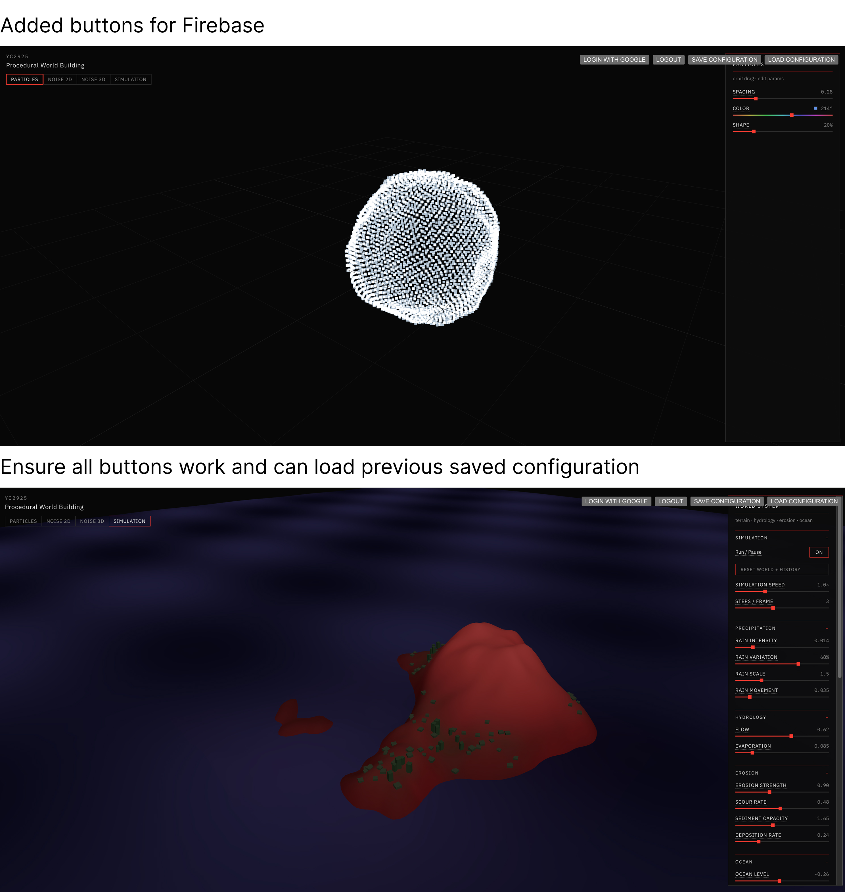
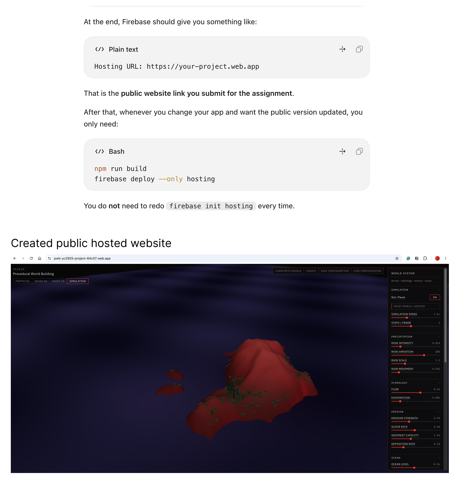

# 05 — Vegetation Simulation

## Overview

Vegetation was added on top of the hydraulic grid so plants would respond to the same water, rain, elevation, slope, and erosion — not as a second noise texture. There is no Vegetation tab. It runs inside **Simulation** when Vegetation is enabled.

Solver: `stepVegetation()` in `app/src/simulation/vegetation.js`.

## Concepts

Each land cell stores a density in `0–1` and a coarse type (bare, pioneer, shrub, denser cover). Growth is gated by **suitability**, roughly:

```text
suitability ≈ moisture × slope × elevation × stability × (1 − flood)
```

- **Soil moisture** is a slower field. A little surface water infiltrates each step; evaporation and drought drain it. Ocean cells are treated as saturated and cannot grow.
- **Slope suitability** falls as local height differences exceed Slope tolerance (rooted cells tolerate slightly more).
- **Elevation suitability** is a band above ocean level (`elevationRange`), not “higher is greener.”
- **Stability** drops where recent scour is high (`disturbance`).
- **Flood stress** appears when ponded water is deep.

**Spread** lets healthy neighbors raise colonization. **Die-off** removes density on unsuitable cells, plus extra loss from scour and floods. **Erosion resistance** is the feedback into hydrology: vegetation reduces outflow and scour in `stepHydraulic()`.

Telemetry coverage counts only land cells (above ocean), so a high ocean does not look like a dead planet just because most of the grid is water.

## Implementation

| File | Role |
|---|---|
| `app/src/simulation/vegetation.js` | Moisture, suitability, growth, types |
| `app/src/simulation/hydraulic.js` | Uses vegetation for `flowResistance` and `rootProtection` |
| `app/src/simulation/HydraulicWorld.jsx` | Ground tint + instanced plant meshes |
| `app/src/ui/SimulationPanel.jsx` | Ecology sliders and view toggles |
| `app/src/simulation/settings.js` | Defaults and tooltips |

Order in a frame: hydraulic step first (rain, flow, scour), then vegetation (infiltration from remaining water, then growth/death). That way plants see this step’s flood and erosion.

Types (after density update):

| Type | Condition (approx.) |
|---|---|
| 0 bare | Density &lt; 0.045 or underwater |
| 1 pioneer | Sparse, drier or freshly colonized |
| 2 shrub | Density &gt; 0.3 and some moisture |
| 3 denser | Density &gt; 0.68, wetter, low disturbance |

## Parameters / Controls

| Parameter | Default | Effect |
|---|---|---|
| Vegetation enabled | on | Pauses growth; existing density is kept. |
| Show vegetation | on | Ground coverage + instances. |
| Show soil moisture | off | Violet overlay of the slow moisture field. |
| Growth rate | 0.32 | How fast suitable cells fill in. |
| Moisture preference | 0.50 | Target soil moisture. Too dry or too wet (relative to this) is worse. |
| Elevation range | 0.62 | Vertical band above ocean where plants can live. |
| Slope tolerance | 0.18 | Maximum steepness tolerated. |
| Spread | 0.70 | Neighbor influence on colonization. |
| Die-off rate | 0.13 | How fast unsuitable cells empty. |
| Erosion resistance | 0.78 | How much existing plants protect soil and slow flow. |

Hydraulic rain, evaporation, ocean level, and scour still dominate where plants *can* exist, even if these sliders are unchanged.

## Experiments / Observations

- After a reset, vegetation lags hydrology. Moisture has to infiltrate before coverage appears. Turning rain off and watching die-off is slower than turning scour up.
- Steep red faces stay bare even with high growth rate if slope tolerance is low. Raising slope tolerance greens cliffs that then fail as soon as a storm cuts them (disturbance).
- Ocean level is an ecological boundary. Raise the sea and the green belt moves upslope; the old shoreline dies because those cells are flagged submerged.
- Moisture preference fights flooding. A high preference on a very rainy island still fails in ponds because `floodStress` is separate from the moisture curve.
- Erosion resistance is the loop that makes the study worth doing. Dense cover on a bench slows channels; if I then spike rain and scour, the overlay shows disturbance and the instances thin out, after which the next storm cuts faster.
- Spread at 0 grows in place as isolated cells. High spread fills basins once a seed patch exists, which reads more like colonization than per-cell noise.

## Screenshots / Examples



*Simulation view with green instances on the lower and mid slopes. Steeper, brighter-red relief stays thinner. Ecology sliders are in the right-hand panel.*



*Same coupling on the public Hosting URL: plants track land above the ocean plane, not the water surface.*

<!-- TODO: Add screenshot of soil-moisture overlay with vegetation hidden -->

## Key Takeaways

- Vegetation here is a consumer of hydraulic state. It does not have its own climate model.
- The useful experiment is the feedback: plants slow erosion; erosion and floods kill plants.
- Coverage must be measured on land only, or ocean cells erase the signal.
