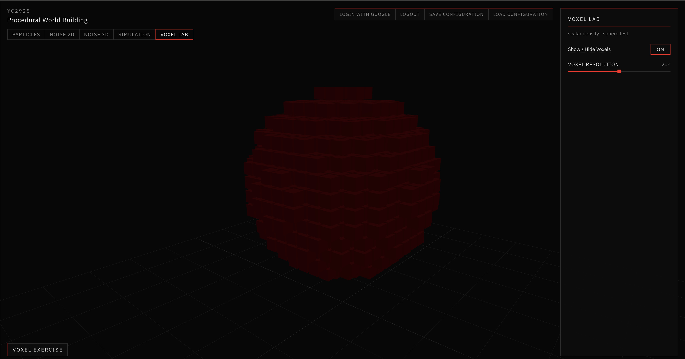
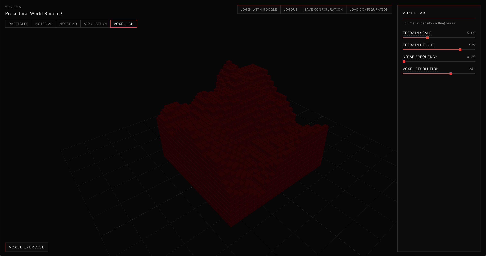
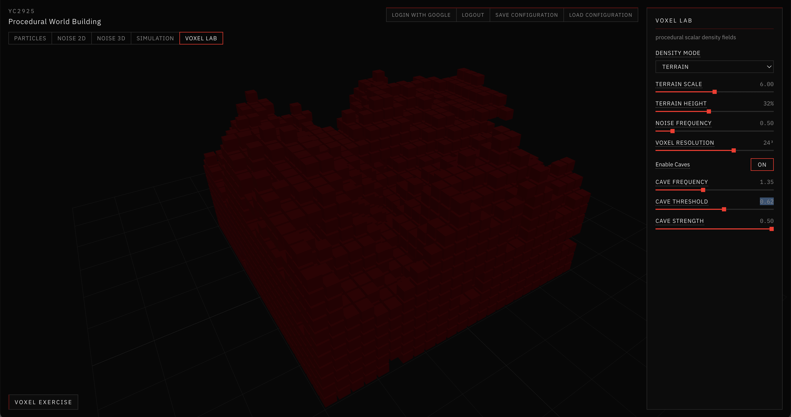
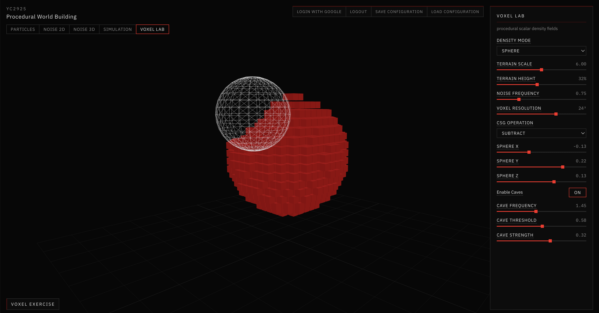
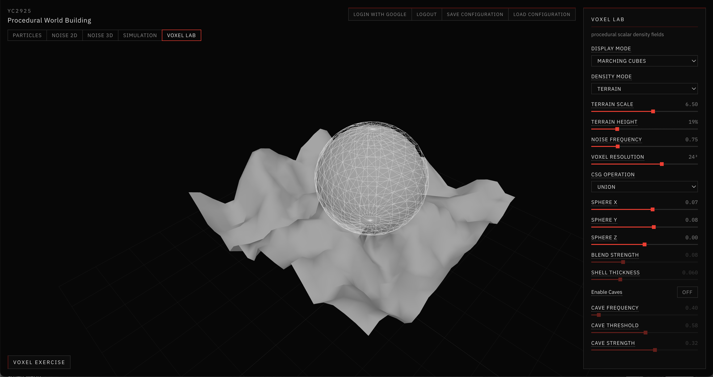
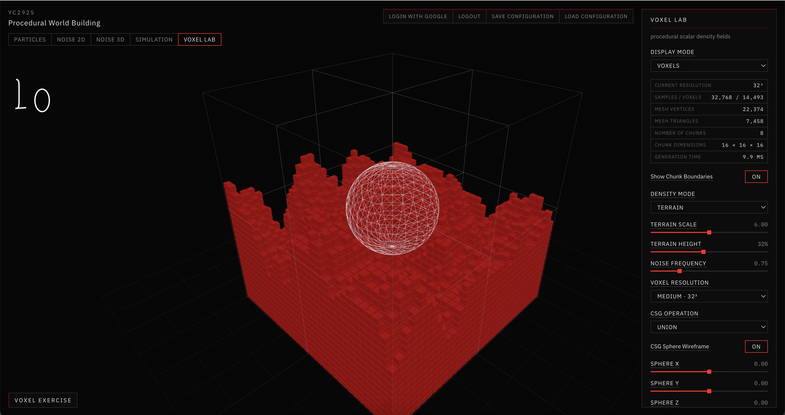
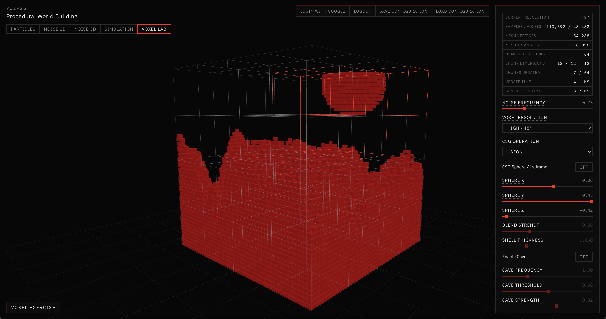

# 06 — Voxel Experiments

## Overview

Voxel Lab is a separate workspace from the heightfield simulation. The assignment was to treat space as a **scalar density field** (`density > 0` solid, `density ≤ 0` empty) and then layer caves, CSG, meshing, resolution, and chunking on that same field — without rebuilding the hydraulic app.

Tab: **Voxel Lab**. Assignment View groups the tools into nine demo topics and a live status strip.

Concept primer: [Tutorials/Voxels.md](../Tutorials/Voxels.md). Week log: [Documentation/Week4.md](../Documentation/Week4.md).

## Concepts

A **voxel** is a cell in a 3D grid. Here the interesting data is not the cube mesh; it is the density sample.

**2.5D heightfield vs volumetric terrain** — Noise 3D stores one height per (x, z). Voxel terrain stores a value at (x, y, z). Everything below a noise surface can be solid, so caves and CSG can hollow the interior.

**CSG on densities** — Union `max`, intersection `min`, subtract, smooth union, and shell run on scalars, not on triangle booleans.

**Meshing** converts the field to triangles:

- Marching Cubes — iso-surface through the field
- Greedy meshing — merged faces, block look
- Surface Nets / Dual Contouring — other dual/iso methods on the same samples

**Chunking** splits the volume so a CSG sphere move remeshes overlapping chunks instead of the whole 48³ grid.

## Implementation

| File | Role |
|---|---|
| `app/src/voxel/density.js` | Modes, caves, CSG sampler |
| `app/src/voxel/noise3d.js` | 3D value noise for caves |
| `app/src/voxel/chunks.js` | Chunk world, localized updates |
| `app/src/voxel/meshing.js` | Greedy, surface nets, dual contouring |
| `app/src/voxel/MarchingSurface.jsx` | Marching Cubes + buffer meshers |
| `app/src/voxel/VoxelCubes.jsx` | Instanced solid cells |
| `app/src/voxel/CsgSphere.jsx` | Wireframe CSG gizmo |
| `app/src/ui/VoxelLabPanel.jsx` | Assignment sections + controls |
| `app/src/views/VoxelLabView.jsx` | Scene + status HUD |

Density modes share `createDensitySampler()`: Terrain, Sphere, Floating Island, Strata. Caves subtract 3D noise only where the base is already solid. CSG is applied last.

Resolution presets: 16³ / 32³ / 48³. Default chunk size 8 (12 at 48³ when compatible). Ghost cells keep seams from splitting the iso-surface.

This world is finite. There is no streaming or render-distance system.

## Parameters / Controls

| Parameter | Effect |
|---|---|
| Density mode | Terrain / Sphere / Floating Island / Strata |
| Terrain scale / height / noise frequency | Size of the volume and of the rolling surface |
| Enable caves | 3D noise subtracted from interior density |
| Cave frequency / threshold / strength | How open and how frequent voids are |
| CSG operation | None, Union, Subtract, Intersection, Smooth Union, Shell |
| Sphere X/Y/Z | Gizmo position |
| Blend strength / shell thickness | Smooth Union and Shell only |
| Display mode | Voxels, surface, or both |
| Meshing method | Marching Cubes, Greedy, Surface Nets, Dual Contouring |
| Resolution | Low / Medium / High |
| Show chunk boundaries | Wireframe boxes; updated chunks flash |
| Assignment View | Numbered topics + HUD (no new simulation) |

Status strip: Density Mode, Resolution, Display Mode, CSG Operation, Chunk Count, Triangle Count, Generation Time.

## Experiments / Observations

- The sphere-of-cubes test made the grid readable. Once terrain was on, cubes still hid the iso-surface: all four meshers looked identical until voxels were hidden and the surface material differed.
- Caves only read as caves in a cut or with cubes on. On a closed Marching Cubes shell they are easy to miss unless CSG or a low camera shows the interior.
- Subtract CSG is the clearest boolean. Union grows a blob; intersection is confusing until the gizmo is fully inside the terrain.
- Smooth Union needs a visible blend strength; too small and it looks like ordinary union.
- Resolution is the honest cost knob. 16³ is a diagram; 48³ is where chunking pays off. Moving the CSG sphere at 48³ remeshed on the order of a dozen of 64 chunks and a few milliseconds, versus a full rebuild.
- Greedy meshing is the one that should look “Minecraft.” If Show Voxels is on, you never see it.

## Screenshots / Examples

*First test: distance-field sphere, solid cells as cubes, Show / Hide and Resolution only.*

*Coherent 2D noise as a surface; cells below are solid. Not a displaced plane of triangles.*

*Enable Caves: 3D noise subtracted inside the solid, not only on the top face.*

*Wireframe sphere as a density operand. Subtract carves the volume; brighter red cubes are the remaining solid.*

*Same field as a continuous surface (here with Union). Display Mode = Marching Cubes.*

*Medium 32³, debug counts, chunk wireframes. Metrics: samples, triangles, generation time.*

*High resolution, 64 chunks. Moving the CSG operand updates a subset (highlighted), not the whole volume.*

*Final layout for critique: nine numbered topics, compact HUD, existing tools only.*

## Key Takeaways

- One sampler should drive cubes, caves, CSG, and every mesher. If those diverge, the demo stops teaching the field.
- Cubes are a debugging view. Surfaces are where meshing methods differ.
- Chunking is worth showing even on a tiny world: the metric is chunks updated, not a streaming planet.
- Assignment View was organization, not a new algorithm.
