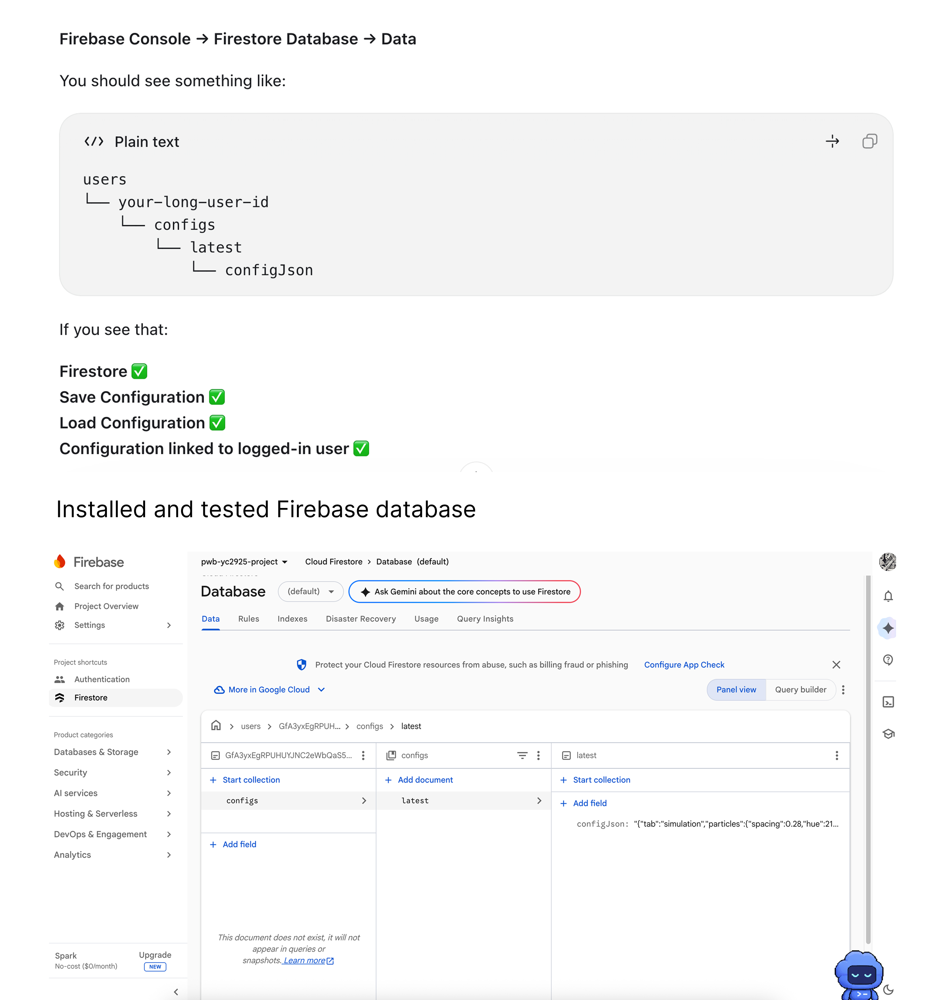

# 07 — Firebase

## Overview

Firebase was added so configuration could follow a Google account and so the assignment could be opened from a public URL. It is infrastructure around the existing tabs, not a new simulation.

Install walkthrough: [Tutorials/Firebase_Tutorial.md](../Tutorials/Firebase_Tutorial.md). Week log: [Documentation/Week4.md](../Documentation/Week4.md).

Public site: [https://pwb-yc2925-project-64c07.web.app](https://pwb-yc2925-project-64c07.web.app)

## Concepts

Three products are in use:

1. **Authentication** — Google popup. Save/load refuse to run without `auth.currentUser`.
2. **Cloud Firestore** — one document per user: `users/{uid}/configs/latest` with a `configJson` string.
3. **Hosting** — the Vite `dist` folder. SPA rewrite sends all paths to `index.html`.

Storage is initialized in `firebase.js` and save also writes `users/{uid}/latest-config.json`. The assignment checklist treated Firestore as the required database; Hosting is the public URL.

What **save actually stores** today (`App.jsx`): `tab`, `particles`, `noise`. It does not serialize hydraulic erosion sliders or Voxel Lab settings. Loading noise is enough to restore the Simulation’s *starting* heightmap after reset; live water and vegetation are not in the document.

## Implementation

| File | Role |
|---|---|
| `app/src/firebase.js` | `initializeApp`, `auth`, `provider`, `db`, `storage` |
| `app/src/App.jsx` | `login`, `logout`, `saveConfig`, `loadConfig` + buttons |
| `app/firebase.json` | Hosting `public: dist`, SPA rewrite |
| `app/.firebaserc` | Project id `pwb-yc2925-project-64c07` |

Buttons sit in `.firebase-actions` and follow [style-guide.md](../style-guide.md) (square, hairline, red signal on the active chrome — not a second brand color).

After the first `firebase init hosting`, republish is:

```bash
cd app
npm run build
firebase deploy --only hosting
```

`firebase init hosting` is not needed every time.

## Parameters / Controls

There are no simulation parameters here. The four actions:

| Control | Effect |
|---|---|
| Login with Google | Popup auth. Required before save/load. |
| Logout | `signOut`. |
| Save configuration | Writes `tab` + `particles` + `noise` to Firestore (and Storage). |
| Load configuration | Reads that document and restores tab / particle / noise state. |

## Experiments / Observations

- Forgetting to log in fails loudly (`Login first`). That is better than writing an anonymous document that cannot be found later.
- Save from Particles, then load, restores spacing/hue/shape and the Particles tab. Save from Noise 3D restores the layered heightmap in both Noise views and Simulation’s next reset.
- The Firestore console tree `users → uid → configs → latest → configJson` is the proof the write landed. If the console is empty, the app either was not signed in or the rules blocked the write.
- Hosting can lag local `npm run dev`. Checking the wrong port or an old deploy is why UI restyles appeared “missing.”
- Because Voxel Lab and live hydrology are not in `configJson`, Firebase is not a full world save. It is a settings bookmark for the shared noise/particle state.

## Screenshots / Examples



*Console: `users / {uid} / configs / latest` with `configJson`. Confirms Auth + Firestore + per-user save.*


*Buttons in the existing chrome. Top: Particles. Bottom: load still works on Simulation (restored noise terrain, not a water snapshot).*


*`https://pwb-yc2925-project-64c07.web.app` after `npm run build` and `firebase deploy --only hosting`.*

## Key Takeaways

- Keep Firebase I/O in React (`App.jsx`), config in `firebase.js`, and HTML out of it.
- A useful save is per-user and boring: one `latest` document beats a custom schema for this assignment.
- Hosting is a build artifact. Local Vite remains the place to iterate; deploy when a still or a URL is needed.
