# 08 — Shader Experiments

This study asks how shaders can become part of a procedural system for generating **vegetal ornament on religious architectural facades**.

Shader Lab is not a style picker. I used it to test whether the same generated mesh can communicate different architectural facts depending on the shading strategy:

- **form** — can I still read stems, leaves, and the wall plane?
- **depth** — does the surface read as carved rather than as a decal?
- **material** — can stone, grain, and weathering change without a photograph?
- **growth / process** — can the generator’s 0–1 progress become visible, not only the finished mesh?
- **spatial hierarchy** — does world position or distance to an anchor change how ornament is colored?
- **light** — how much of the reading is raking light, rim, and cavity rather than albedo?

The same test geometry can therefore be interpreted as clay, as incised masonry, as sandstone, as a growth sequence, or as a night-lit silhouette. Geometry stays the score; the shader is the performance.

Research brief that preceded this lab: [Shader Studies](../Tutorials/Shader-Studies.md). Visual rules for the chrome (not the viewport): [style guide](../style-guide.md).

---

## Shader Lab

Tab: **Shaders**. Default study (current code): Architectural Specimen geometry, Relief strategy. The sections below were written against the smaller test meshes; the specimen is documented at the end.

The layout is:

```
SHADER LAB
        ↓
test geometry
        ↓
shader strategy
        ↓
shader-specific parameters
        ↓
real-time viewport
```

I pick a mesh, pick a strategy, then drag that strategy’s sliders. Uniforms are copied from a settings ref every frame, so the viewport updates while the slider moves. Switching **strategy** or **geometry** rebuilds the material or the mesh; dragging a parameter does not.

Shared controls:

| Control | Effect |
|---|---|
| Test Geometry | Architectural Specimen (default) / Organic Rock / Plane / Sphere / Relief / Vegetal — see [From Organic Rock to Architectural Specimen](#from-organic-rock-to-architectural-specimen) |
| Shader Strategy | Baseline, Relief, Stone, Curvature, Growth, Position, Illumination, Scan / Wireframe |
| Rotate Model | Slow Y-axis turn so lighting and growth can be read from more than one angle |
| Compare | Same mesh twice: Baseline on the left, current strategy on the right |
| Reset Shader | Restores only the active strategy’s defaults |

A status strip lists the active shader, geometry, and FPS, plus a short note on what that strategy is testing. Compare adds a `Baseline | Current` row.

The chrome follows the project style guide: near-black overlays, hairline rules, one red signal color, square controls. The **viewport does not have to follow that aesthetic**. It is an experimental environment for trying different materials and lights on the same ornament.

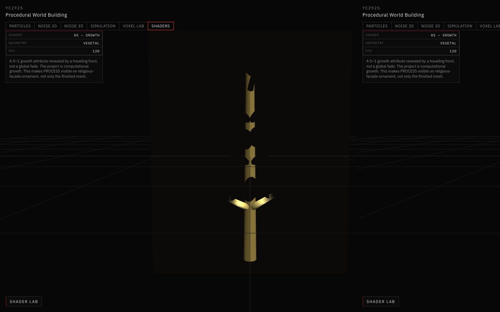

*Shader Lab interface showing the test geometry, active shader strategy, and real-time parameter controls.*

---

## Test Geometry

Four meshes exist. Each also carries baked vertex attributes `aGrowth` and `aRelief` so strategies that need process or depth have something to read even on a plane.

### Plane

A subdivided card. Growth is authored along U, so a traveling front can sweep the surface. Relief is almost flat (`0.08`). I used this when I wanted a quiet surface for grain and roughness without branches competing for attention.

### Sphere

A UV sphere. Growth runs from the bottom pole to the top. It is the honest lighting object: normals and curvature change continuously, so raking light and rim light are easier to judge than on a flat wall.

### Relief

A framed architectural panel. The interior is displaced with sines plus a central boss; the frame is raised. `aRelief` is derived from that extrusion. This is the mesh I used when I wanted to see carved depth and cavity shadow without the vegetal graph.

### Vegetal

A stand-in facade motif: a thin wall box, a stem, branching cylinders, and flattened leaf spheres, merged into one geometry. `aGrowth` increases from the base of the stem toward the tips (wall vertices are marked so the growth shader can leave the masonry dormant). This is the mesh that matches the project direction — not a full facade generator, but enough branching ornament to ask whether a shader still reads as carved plants.

Different geometry is useful because a shader can look convincing on a sphere and collapse on a vine. Plane is for material. Sphere is for normals and light. Relief is for architectural depth. Vegetal is for the actual ornamental question.

---

## Shader Experiments

Seven strategies are implemented. Baseline is a `MeshStandardMaterial`. The other six are custom GLSL on a shared vertex stage that passes world position, world normal, view direction, UV, `aGrowth`, `aRelief`, and local Z.

### 01 — Baseline

#### Concept

An unmodified standard surface. I needed a comparison plate so later shaders are judged against clay-colored masonry, not against each other.

#### Inputs

Three.js lighting in the scene (hemisphere, ambient, two directionals). No custom attributes.

#### Parameters

| Parameter | Effect |
|---|---|
| Base Color | Neutral ground color before any study shader |
| Roughness | Higher reads as unpolished stone; lower as a tighter highlight |
| Metalness | Keep near zero for masonry. Included so the baseline stays a complete standard material |

#### What I Observed

Raising roughness kills the highlight and the vine reads as plaster. Dropping it makes the same cylinders look slightly polished. Metalness quickly looks wrong for a facade. Compare mode is the fastest way to see that later shaders are doing more than tinting this material.

#### Relevance to My Project

Religious ornament is rarely shown as gray clay. Baseline is still necessary: if I cannot tell what the mesh is doing without a fancy shader, the generator — not the material — is the problem.

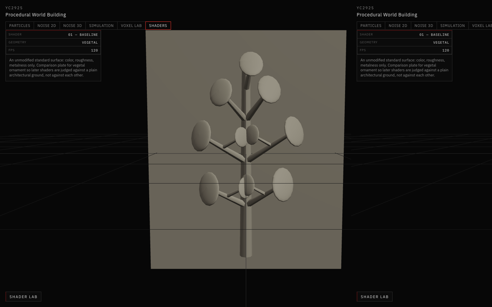

*Vegetal test mesh under Baseline: color, roughness, and metalness only, used as the comparison plate.*

---

### 02 — Relief

#### Concept

A raking-light reading of raised versus recessed form. Lit faces go warm; cavities go dark. Baked extrusion depth (`aRelief`) further tints the surface so bosses stay brighter than hollows even when the normal is similar.

#### Inputs

- world-space normals
- light direction (XYZ sliders, normalized in the shader)
- baked `aRelief`

#### Parameters

| Parameter | Effect |
|---|---|
| Relief Contrast | Hardens the raised / recessed split under raking light (exponent on wrapped N·L) |
| Depth Intensity | How strongly baked extrusion depth tints the surface |
| Light X / Y / Z | Raking light direction |
| Shadow Emphasis | How far cavities go toward black |

#### What I Observed

On the Relief panel, a side light (default X `0.65`) makes the inner undulations read as carving. If I push Light Z up and Light X toward zero, the same displacement looks like a flat graphic. Higher Shadow Emphasis turns hollows into ink; Depth Intensity is what keeps the central boss from collapsing into the field.

#### Relevance to My Project

Facade foliage is read through light and shadow as much as through silhouette. A geometrically correct vine can still look stuck on if the light is frontal. This strategy asks whether the mesh still looks incised when not a single vertex has moved.

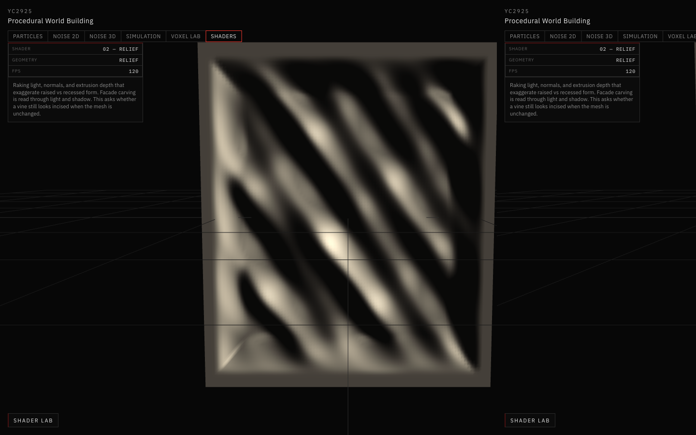

*Relief geometry with the Relief shader: raking light, normals, and baked extrusion depth separating raised form from cavity.*

---

### 03 — Stone

#### Concept

Procedural masonry instead of a photo. World-space fBm darkens the body, a slower fBm supplies vein-like streaks, three offset noises add mineral tint, and weathering darkens recesses and faces that point less upward. Specular tightness follows Roughness.

#### Inputs

- world position (noise domain)
- world-space normals
- baked `aRelief` (weathering in recesses)
- light direction (fixed in this strategy, not a slider)
- 3D value-noise fBm (five octaves)

#### Parameters

| Parameter       | Effect                                                                                                             |
| --------------- | ------------------------------------------------------------------------------------------------------------------ |
| Material Preset | Starting points: Limestone, Marble, Sandstone, Concrete. Parameters stay editable; editing marks the preset Custom |
| Base Color      | Ground hue of the stone body                                                                                       |
| Grain Scale     | Spatial frequency of grain and veins                                                                               |
| Grain Strength  | How visible grain and veins are against the base color                                                             |
| Roughness       | Tight marble highlight vs open limestone                                                                           |
| Color Variation | Mineral tint range across the surface                                                                              |
| Weathering      | Dirt and darkening in recesses and less-exposed faces                                                              |

#### What I Observed

Increasing Grain Scale produces smaller, more frequent speckles; lower values make broader blotches. Grain Strength is the visibility knob — at ~0.2 limestone is a hint; at ~0.4 sandstone grain is obvious on the same vine. Roughness is what separates marble (tight highlight, default `0.28`) from sandstone (`0.82`). Weathering only reads where `aRelief` is low, so the vegetal wall and branch undersides pick up dirt while the leaf faces stay cleaner.

#### Relevance to My Project

The generator should be able to instance the same vegetal graph onto different buildings. Stone is how that graph becomes limestone, marble, or sandstone without new topology and without locking the ornament to one photograph.

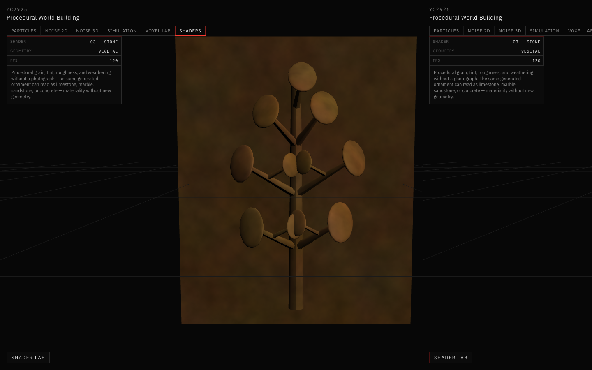

*Vegetal mesh with the Stone shader: world-space fBm grain, mineral tint, and weathering, without a photographic texture.*

---

### 04 — Curvature

#### Concept

A readability drawing from how quickly the normal changes across neighboring fragments. Convex regions (facing the camera) go toward a light ridge color; concave regions go toward a cavity black. This is **not** a 1-ring mesh Laplacian — it is `dFdx` / `dFdy` of the world normal.

#### Inputs

- world-space normals
- view direction (to split convex vs concave)
- screen-space normal derivatives

#### Parameters

| Parameter | Effect |
|---|---|
| Edge Intensity | Brightens convex ridges |
| Cavity Intensity | Darkens concave regions |
| Curvature Scale | Sensitivity of the derivative approximation |
| Contrast | Graphic strength of the curvature bias |

#### What I Observed

On Vegetal, stems pick up ridge ticks and the junctions between branch and leaf go dark. Raising Curvature Scale makes those ticks louder; too high and the low-poly leaf discs speckle. Contrast is the difference between a soft clay sculpture and an engraving. The Relief panel is cleaner than the vine because the displacement is smoother.

#### Relevance to My Project

Dense vegetal relief collapses at a distance. A curvature bias is a way to keep midribs and hollows parseable when the stone shader is quiet — closer to how a carver or an engraver holds form than to a material.

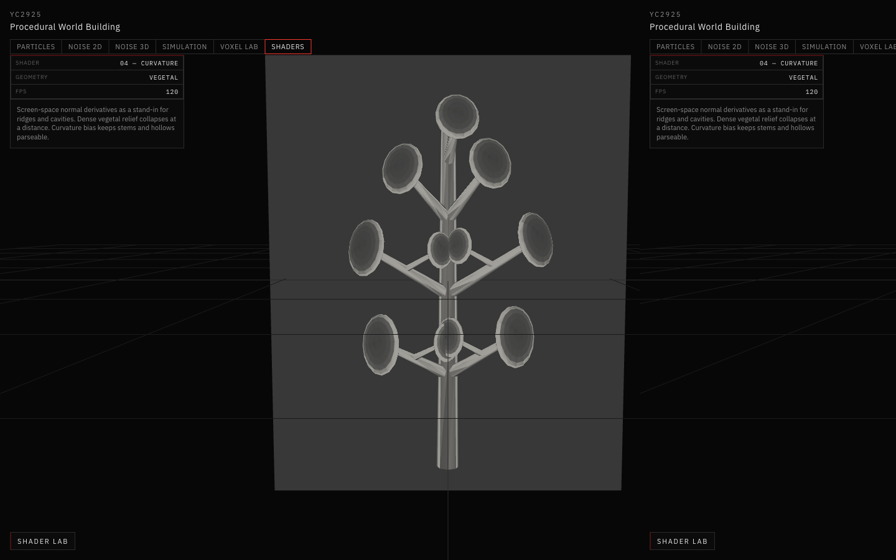

*Screen-space curvature on the vegetal mesh: convex ridges lighten, concave junctions darken.*

---

### 05 — Growth

#### Concept

A 0–1 growth attribute revealed by a **traveling front**, not a global fade. Vertices whose `aGrowth` is below the current progress are shown in the growth color; the rest stay dormant. A bright band marks the live edge.

See the dedicated section below.

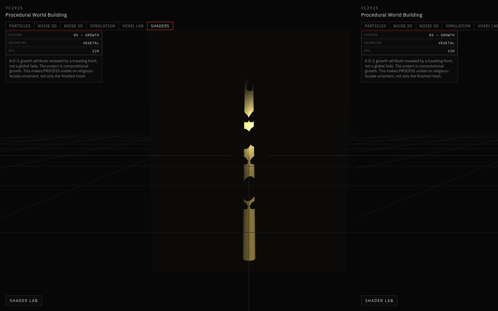

*Growth Progress ≈ 0.25: the stem is coming up the wall; most branches and leaves are still dormant.*

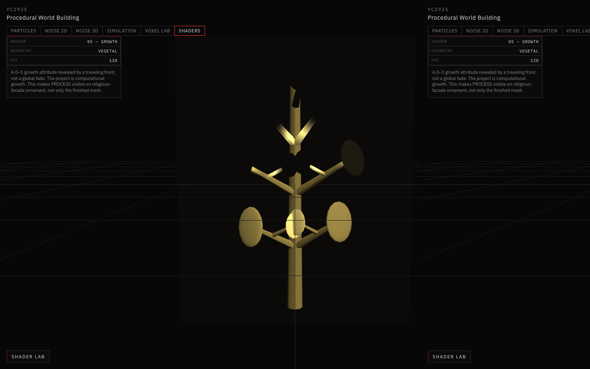

*Growth Progress ≈ 0.75: branches and leaves have joined the revealed set. Same mesh, later process.*

---

### 06 — Position

#### Concept

Color from world-space location. Either a single axis (X / Y / Z) or distance to an adjustable anchor. The mix is scaled, offset, and optionally hardened with a contrast smoothstep, then wrapped with a simple N·L term.

#### Inputs

- world position
- world-space normals
- light direction (fixed)
- optional anchor point

#### Parameters

| Parameter | Effect |
|---|---|
| Axis | World axis used when Anchor Mode is off (default Y) |
| Gradient Scale | How quickly color changes with position |
| Gradient Contrast | Soft mix vs a harder spatial cut |
| Gradient Offset | Shifts the gradient along the axis or radius |
| Color A / Color B | Low and high ends of the gradient |
| Anchor Mode | Distance from an architectural point instead of an axis |
| Anchor X / Y / Z | World-space anchor |

#### What I Observed

On Vegetal with Axis Y, the base of the stem stays in Color A and the upper branches pick up Color B. Gradient Offset slides that split up or down the wall. Anchor Mode turns the split into a radius around a point I can put near a notional portal. This is spatial hierarchy, not botany.

#### Relevance to My Project

Ornament next to a doorway should not behave like ornament at a cornice. Position is a cheap way to let architectural location drive the shader before the generator has a full facade graph.

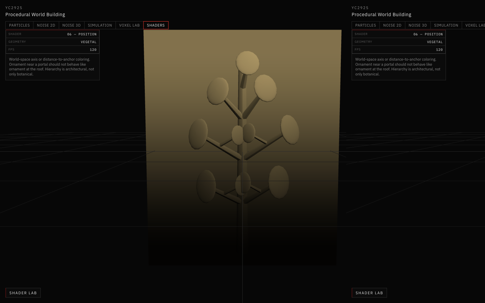

*World-space Y gradient on the vegetal mesh: lower masonry and stem in Color A, upper growth in Color B.*

---

### 07 — Illumination

#### Concept

Presentation lighting, not a physical sun. Directional N·L is raised to a falloff exponent, a rim from `1 − N·V` sits on the silhouette, and a mild distance term darkens the far side of the motif. Light color tints both the key and the rim.

#### Inputs

- world-space normals
- view direction
- world position (distance attenuation)
- light direction (XYZ sliders)

#### Parameters

| Parameter | Effect |
|---|---|
| Light X / Y / Z | Directional key |
| Light Intensity | Brightness of the directional term |
| Rim Intensity | Strength of silhouette / grazing light |
| Rim Width | How tight the rim sits on the silhouette (exponent) |
| Falloff | Exponent on N·L. Higher is a harder, more theatrical key |
| Light Color | Color of the key and rim |
| Surface Color | Albedo under this lighting study |

#### What I Observed

Default values already rim the leaf discs and leave the wall side in shadow. Raising Falloff makes the key theatrical; lowering Rim Width tightens the edge to a pinstripe. This is the largest change in *mood* for the same vine — night flood vs studio clay — without touching growth or stone.

#### Relevance to My Project

Carved plants on a facade are perceived through lighting convention: raking sun, interior spill, night flood. The study is that convention, not a sacred glow.

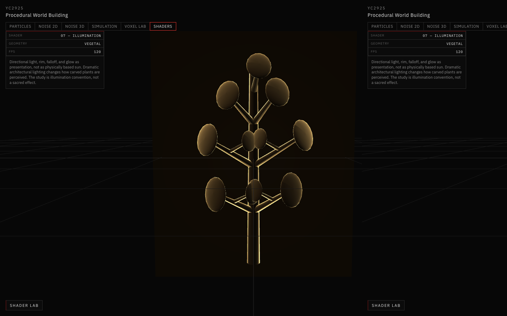

*Vegetal mesh under the Illumination study: directional key, rim on the silhouette, and a darker wall plane.*

---

## Growth Shader

This is the experiment that matters most for the project, because the project is computational growth.

**Final form** is what the mesh already is: a stem, forks, leaves on a wall. If I only render Baseline or Stone, I am looking at the result of a procedure that already finished.

**Procedural process** is the 0–1 value along that structure. On Vegetal, `aGrowth` is authored along each cylinder from root toward tip (roughly `0.02` at the base of the stem, into the `0.8–0.96` range at the last leaves). The wall is tagged so it does not participate as ornament.

The fragment shader compares `aGrowth` to **Growth Progress**:

- vertices still ahead of the front stay **Dormant Color**
- vertices already passed by the front mix to **Growth Color**, with a wrapped N·L
- a band of width **Growth Edge Width** around `progress` adds a bright front, scaled by **Growth Contrast**

That is why progress `0.25` and `0.75` are different pictures of the same mesh, not two opacities of the same picture. A global fade would dim the whole vine; a traveling front climbs the authored growth order.

| Parameter | Effect |
|---|---|
| Growth Progress | `0` hides the ornament; `1` reveals the full structure along baked growth |
| Growth Edge Width | Thickness of the live front |
| Growth Contrast | Brightness of that front |
| Growth Color | Color of revealed ornament |
| Dormant Color | Color of geometry not yet grown |
| Auto Grow | Animates Growth Progress continuously (`progress + dt * speed`, wrapped to `0–1`) |
| Growth Speed | Playback rate while Auto Grow is on |

I tested Auto Grow with Speed around the default `0.18`. The slider in the panel catches up on a short interval so the numeric readout follows the animation. Turning Auto Grow off leaves Progress where it stopped, which is useful for stills.

This is still a visualization on a baked attribute. The useful next step is to write the same `aGrowth` from the actual generator — branch age, iteration index, or simulation time — so the shader is not pretending to grow, it is displaying the procedure that already ran. Uniforms already exist for progress, edge, and colors; they could be driven by the generator instead of by the lab sliders.

---

## Material / Stone Study

Stone is the place I asked: **how does material change our perception of generated ornament?**

The noise is 3D value noise hashed on a lattice, interpolated, then summed as five-octave fBm. Grain is `fbm(worldPos * grainScale)`. Veins are a slower fBm (`grainScale * 0.28`) folded around `0.5`. Mineral tint is three independent fBm samples scaled by Color Variation. None of this uses a texture map or UVs in the fragment stage — the domain is world position, so the vine does not look stamped when branches share a material.

On the same Vegetal mesh:

- **grain** changes whether I read crystalline speckle or sandy blotches
- **roughness** changes whether I read polished marble or open limestone
- **color variation** adds mineral shift so the body is not a flat fill
- **weathering** dirties recesses; without it the vine looks newly cut

I found that once grain and weathering are on, I stop seeing “a 3D plant model” and start seeing a piece of masonry that happens to be vegetal. That is the architectural question. The geometry did not change.

Presets are only starting points. Limestone is quiet (grain `9.5`, strength `0.22`, roughness `0.74`). Marble lowers grain scale and roughness and raises vein strength. Sandstone warms the base color and opens the roughness. Concrete cools the body and keeps variation small.

---

## Relief / Depth Study

Relief shading is a controlled raking-light drawing.

N·L is wrapped slightly so the terminator is not a hard computer-graphics edge, then raised to an exponent driven by **Relief Contrast**. Cavities are `1 − N·L` raised by **Shadow Emphasis**. **Depth Intensity** mixes in baked `aRelief`, so a boss that faces the same way as a hollow still renders lighter if it was extruded.

| Idea | In this shader |
|---|---|
| Surface normals | World normal vs light direction |
| Light direction | XYZ sliders, normalized |
| Raised surfaces | High N·L and/or high `aRelief` → warm |
| Recessed surfaces | Low N·L and/or low `aRelief` → cool / dark |
| Shadow | Cavity term subtracts from the warm mix |

On the Relief panel this is obvious: the frame and inner waves hold as carving. On Vegetal it is subtler because the vine is thin, but the wall stays darker than the stem when depth is on.

That maps onto architectural relief: carved vegetal ornament is a relationship between the wall plane, the raised plant, raking light, and the hollows a chisel leaves. If the shader can keep that relationship after the generator has only produced a mesh, the ornament can stay readable at facade scale.

---

## Shader Pipeline

```
PROCEDURAL SYSTEM
        ↓
VEGETAL GEOMETRY
        ↓
GEOMETRIC INFORMATION
(position / normals / depth)
        ↓
SHADER
        ↓
MATERIAL + LIGHT + VISUALIZATION
        ↓
FINAL FACADE
```

Geometry and shaders do different jobs.

**Geometry** determines the structure: where a branch goes, how a leaf sits, how deep a panel is carved, what `aGrowth` is at each vertex.

**Shaders** determine how that structure is visually interpreted: clay, incised stone, sandstone, a growth sequence, a height hierarchy, a night rim.

Shader Lab keeps those stages separate on purpose. I can freeze the mesh and only change the interpretation, which is the point of the study.

Code lives in `app/src/views/ShaderLabView.jsx`, `app/src/ui/ShaderLabPanel.jsx`, and `app/src/shaders/` (`settings.js`, `geometry.js`, `materials.js`, `common.glsl.js`, `ShaderScene.jsx`).

---

## Key Takeaways

- Shaders can expose procedural information. Growth Progress does not tint the whole mesh; it reveals the authored `aGrowth` order, which is why `0.25` and `0.75` are different stages of the same vine.
- The same Vegetal geometry reads as clay, sandstone, a curvature drawing, or a night-lit silhouette depending on the strategy. Material and light are doing as much work as topology.
- Relief shading, especially with a raking light, is what made the displaced panel look carved. Frontal light on that same mesh looks like a graphic.
- Procedural fBm grain, veins, and weathering let me change period and upkeep without a photographic texture and without rebuilding the ornament.
- Auto Grow is already a playback of process. Binding the same uniforms to a generator’s branch age would turn this visualization into a live report of the procedure.
- Compare (Baseline | Current) is the lab’s argument: if the left mesh is unreadable, the generator is at fault; if only the right mesh is unreadable, the shader is.

---

# From Organic Rock to Architectural Specimen

Everything above uses small test meshes. Two more study objects followed. First, **Organic Rock** replaced the vegetal stand-in with a geological seed. Then the **Architectural Specimen** replaced the rock. The specimen is now the default geometry (`specimen`, strategy `02 — Relief`). Organic Rock is still in the Test Geometry selector as evidence of the step in between. The assignment is still a shader study: the object only exists so the shaders have something worth interpreting.

## Why Organic Rock read as a displaced primitive

`createOrganicRock` (`app/src/shaders/organicRock.js`) starts from `IcosahedronGeometry(1, 6)` and pushes each vertex along its direction from the center using layered noise (mass, erosion, roughness). Two things kept it from reading as an object:

- **It was faceted.** In three r185 that icosahedron is *non-indexed*: 980 triangles, 2,940 vertices, and no shared vertices. `computeVertexNormals()` on non-indexed geometry gives every triangle its own flat normal. Every strategy, including Relief and Stone, therefore lit a polygon mosaic.
- **It was still a sphere.** Displacement was purely radial, so the silhouette could only ever be a bumpy ball. There was no inside, no opening, no hierarchy, and nothing thin. Noise changed the surface but not the organization.

The result looked like a low-resolution polygonal rock. The shaders had very little spatial structure to reveal.

## The shift

```
ARCHITECTURAL SCAFFOLD      ribs, arches, piers, slabs, frames
        +
ORGANIC DEFORMATION         bend, twist, domain warp, erosion
        +
NEGATIVE SPACE              portal, cage, gaps, see-through voids
        +
VEGETAL GROWTH LOGIC        bifurcating crown, lattice, vein channels
```

`createArchitecturalSpecimen` (`app/src/shaders/specimen.js`) assembles the object from **many intersecting indexed parts** instead of deforming one closed surface. It is not manifold, and it does not need to be. At the default seed 7, it is 92 parts and **210,720 triangles**, built in roughly 180–220 ms in the browser. It rebuilds only when a geometry-level slider changes.

Two generators produce every part:

- **Sweep.** A superellipse cross-section is swept along a centripetal Catmull-Rom path, with rounded end caps. The exponent comes from *Architectural Order*: close to 2 gives a round organic stem, around 5–6 gives a rectangular stone rib. UVs are in world units (arc length × perimeter), which the Scan shader relies on.
- **Mass.** This is a rounded box. A uniform sphere grid is projected radially onto \(|x|^n + |y|^n + |z|^n = 1\), which keeps vertex spacing even on the flat faces. Masses also carry low-frequency asymmetry, masonry coursing grooves, worn arrises (erosion concentrated where two faces meet), and shallow vein channels.

The parts are arranged as a vertical hierarchy about 1.6× taller than wide:

| Zone | Components |
|---|---|
| **Top** | fragmented crown: recursive branching ribs (up to 3 levels, 2- or 3-way splits, sections rounding and curling toward the tips), suspended shard plates |
| **Upper** | upper mass where the cage ribs converge; the top ledge ring |
| **Middle** | rib cage (5–6 primary ribs, some broken by erosion) around a narrow central core; crossing diagonal lattice ribs; partial ledge rings with gaps; a lancet screen with a Y-shaped tracery mullion behind |
| **Cavity** | pointed-arch portal: 1–3 stepped archivolts in front and one arch behind, open all the way through |
| **Base** | sill slab and two coursed piers with engaged corner shafts; the gap between the piers is the portal passage |

After assembly, one continuous world-space field processes every part, so parts that touch stay touching:

- **Erosion** bites along each surface's outward direction, limited by the member's thickness.
- **Organic Deformation** applies bend, twist, and a low-frequency domain warp that grow with height. The base stays architectural and the crown goes organic.

Normals are computed per part with indexed, smooth vertex normals. They are checked against the outward direction and then averaged across coincident seam vertices. There is no flat shading anywhere.

### Geometry vs shader

| Scale | Where it lives | Examples |
|---|---|---|
| **Macro** | geometry | silhouette, zones, portal, cage, crown |
| **Meso** | geometry | coursing grooves, worn edges, erosion pits, vein channels, rib breaks, member sections |
| **Micro** | shader | grain, pitting, fine tool/strata lines (`DETAIL_GLSL`: finite-difference normal perturbation driven by `uSurfaceDetail`) |
| **Interpretation** | shader | material, relief, curvature, growth, position, light, scan |

Two of the nine form controls deliberately do **not** rebuild the mesh:

- **Layer Separation** is a vertex offset. Each part carries an `aLayer` vector, and the vertex shader adds `aLayer * uLayerSeparation`. For the Baseline `MeshStandardMaterial`, the same line is injected after `#include <begin_vertex>` via `onBeforeCompile`.
- **Surface Detail** is purely a fragment effect, sampled in object space before the layer offset so it stays attached to each part. Baseline receives no micro detail, so it always shows the pure geometry.

| Control | Rebuilds mesh | What it changes |
|---|---|---|
| Form Seed | yes | every random choice (keyed per feature, so one slider does not reshuffle unrelated ones) |
| Verticality | yes | total height (the zones keep their proportions) |
| Architectural Order | yes | section exponent, arch pointedness, archivolt count, rib regularity, lattice crossing |
| Organic Deformation | yes | bend / twist / warp, increasing toward the crown |
| Erosion | yes | pit and wear depth, broken ribs, more crown shards |
| Branching | yes | crown recursion depth, curl, vein density |
| Void Scale | yes | portal width, ledge gaps, how much the core withdraws |
| Layer Separation | no (uniform) | restrained exploded view |
| Surface Detail | no (uniform) | shader micro detail |

The geometry keys are listed in `SPECIMEN_GEOMETRY_KEYS`. `ShaderScene` memoizes the mesh on exactly those keys, and `useDeferredValue` keeps slider drags responsive while a rebuild is pending.

## What each shader reveals on the specimen

| Shader | Reads |
|---|---|
| Baseline | the geometry alone: hierarchy, voids, member sizes |
| Relief | cavities, ridges, depth, layering (ledges over piers, lattice over core) |
| Stone | material continuity across all parts, grain, weathering streaks, dirt in recesses |
| Curvature | rib edges, arch profiles, intersections of lattice, rib, and ledge |
| Growth | the branching network: base veins → portal → ribs + lattice → crown |
| Position | vertical hierarchy (Y gradient) |
| Illumination | silhouettes, the see-through portal and cage, thin crown members |
| **Scan** | internal organization through the outer surfaces |

Growth ordering baked into `aGrowth`:

- mass veins run about 0.03–0.7 by height;
- shafts 0.05–0.16;
- portal arches 0.08–0.3;
- primary ribs about 0.13–0.46;
- lattice 0.2–0.42;
- crown branches continue from their parent rib up to 0.97;
- the tracery mullion runs 0.18–0.52;
- ledges, shards, the screen frame, and the sill are inactive (`1.2`) and stay stone.

## 08 — Scan / Wireframe

This is not `material.wireframe`. Triangle edges would only show the tessellation, which says nothing about the object. The scan shader draws **structure** instead:

- **Structural lines**: anti-aliased (`fwidth`) grid lines from the world-unit UVs. They run along every rib, arch, and branch, and around every mass.
- **Section contours**: horizontal lines in object Y, with a brighter major line every fifth. The object reads as stacked survey sections.
- **Edge response**: a Fresnel silhouette term plus a crease term from screen-space derivatives of the smooth normal.
- **Surface fill**: a faint Lambert-shaded surface with micro detail, scaled by Surface Opacity.
- **Depth fade**: `exp(-max(viewZ - focusDepth, 0) * k)`. Here `focusDepth` is the camera distance to the object center (updated every frame), so the back half dims and the front structure reads first. Back faces are drawn at half strength.

The material is `transparent`, `depthWrite: false`, `AdditiveBlending`. Every layer contributes, so the core, back arch, and lattice show through the front piers and ribs.

| Control | Effect |
|---|---|
| Line Intensity | brightness of structural lines and contours |
| Surface Opacity | how much shaded surface each layer adds; low values make the interior legible |
| Depth Fade | how quickly layers behind the center fade |
| Edge Contrast | silhouette and crease strength (ribs, arches, thin members) |
| Scan Density | lines per unit for both structural lines and contours |

The limitation is that additive blending saturates where many layers overlap along one view ray. The crown and the core top go close to white at high Surface Opacity or Edge Contrast.

## Screenshots

All five use the same geometry (Architectural Specimen, seed 7, all Specimen Form sliders at their defaults), the same default camera (`[3.6, 1.3, 5.75]`, fov 38), and the same 1024 × 640 viewport. Only the shader strategy changes. Growth is shown at Growth Progress `0.62`.

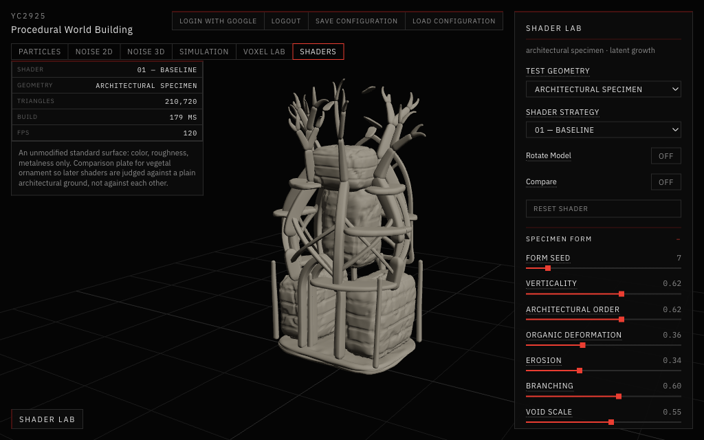

*Baseline. MeshStandardMaterial with no micro detail, so this is the geometry alone. Smooth normals throughout. The hierarchy reads as base piers with shafts and portal, then rib cage with crossing lattice around the core, then upper mass, then branching crown.*

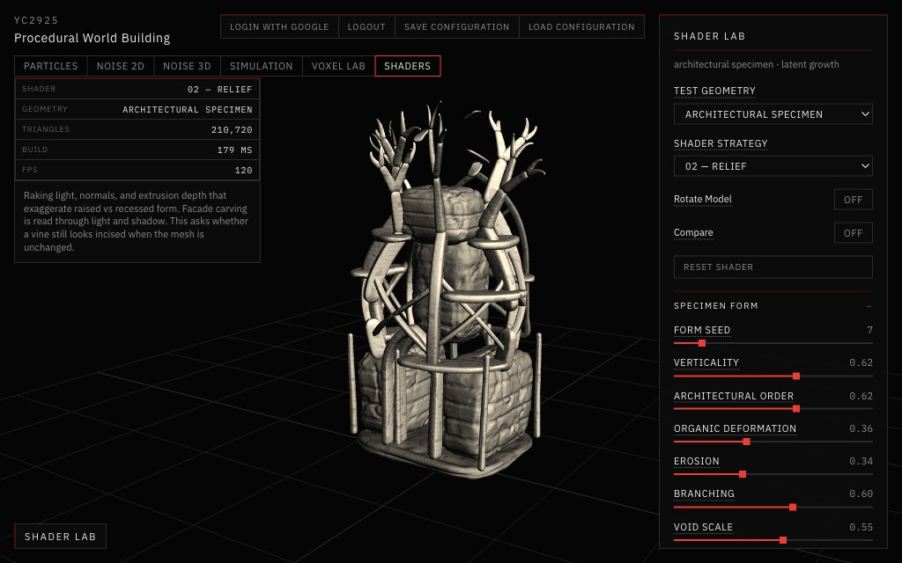

*Relief. Raking light plus cavity and depth terms separate the layers: ledges over piers, lattice over core, coursing grooves and vein channels on the masses. Micro detail adds tooled grain.*

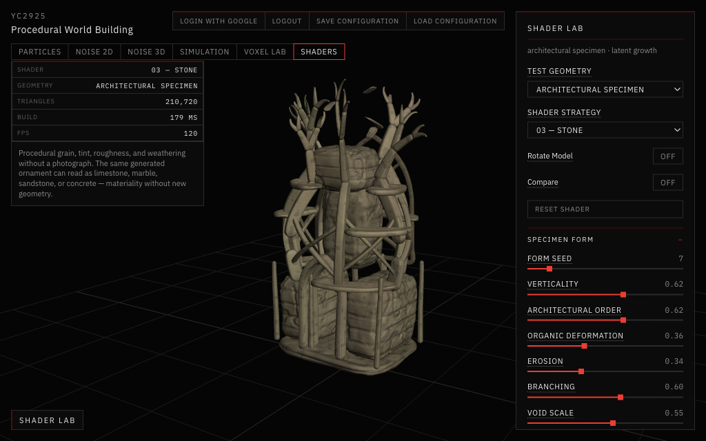

*Stone (limestone preset). One continuous material across masses, ribs, and branches, with grain, darker recesses, and weathering.*

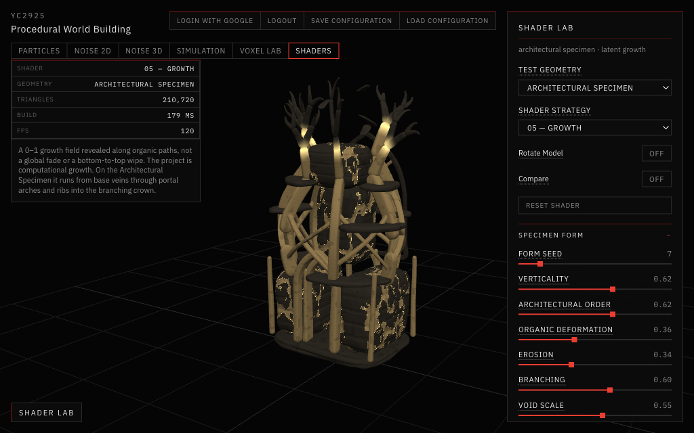

*Growth at 0.62. Shafts, portal arches, primary ribs, and the diagonal lattice are revealed, and the fronts are climbing into the crown branches. Thin vein filaments are grown across the coursed masses. Ledges and shards stay dormant stone.*

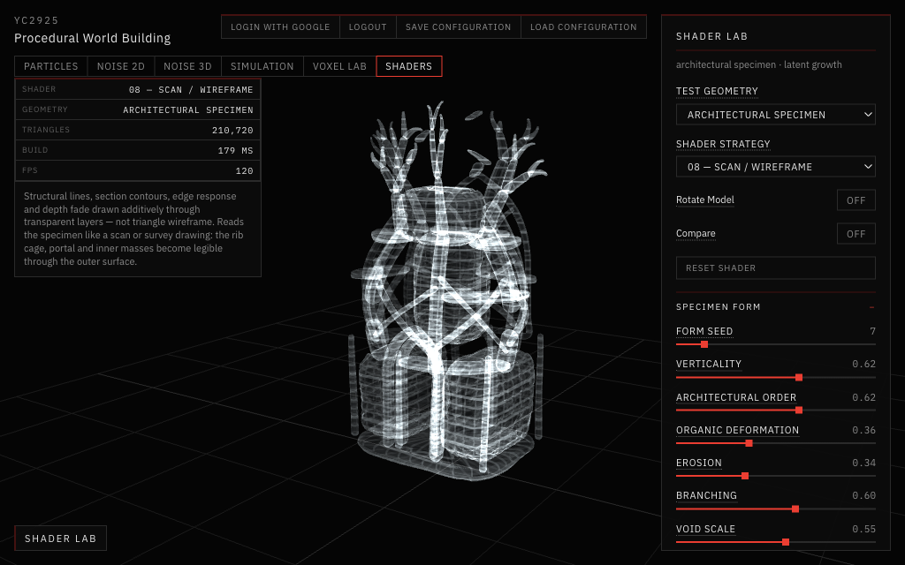

*Scan / Wireframe. Section contours and structural lines, with the core, the back portal arch, and the lattice visible through the front. The internal organization is clearer here than in any lit view.*

## What I observed

- **Baseline is no longer a placeholder.** With 210k smooth-shaded triangles and a real hierarchy, the unshaded object already reads as a specimen. That makes the other strategies comparisons of *interpretation*, not rescues of a weak mesh.
- **Growth needs topology, not only noise.** On the rock, growth was a noise field painted over a ball. On the specimen it follows members that physically connect: pier shaft → arch → rib → lattice → branch. The progress slider now reads as a process moving through a structure.
- **Scan is where the negative space pays off.** The voids, the back arch, and the core behind the cage are what make the transparent view informative. A solid rock would have produced a glowing blob.
- **Micro detail has to stay out of analytic shaders.** At full strength, the Surface Detail normal made Curvature a field of speckles. Curvature now takes only a small fraction of it (`detailNormal(ng, 0.12)`), so edges and intersections dominate again.
- **Vein channels are vertex attributes.** Their sharpness is bounded by the mass grid (128 × 88 per mass). The first attempt thresholded a ridge function and produced camouflage-like patches. Narrow iso-lines of the fBm field, with secondary veins allowed only near the primary ones, read as filaments.

## Key learning

**Geometry creates the macro and meso spatial organization**: zones, voids, members, intersections, coursing, erosion, and the paths growth can take.

**Shaders create everything that interprets that organization**: surface reading, micro detail, material, analytical visualization (curvature, position, scan), and process visualization (growth).

Organic Rock failed as a shader subject because the geometry had no organization for the shaders to interpret. The specimen works because the two layers are split cleanly: the mesh carries structure, and the shaders carry meaning.

Code: `app/src/shaders/specimen.js` (generator), `app/src/shaders/noise3.js` (deterministic JS noise), `app/src/shaders/common.glsl.js` (`VERTEX_GLSL` with `aLayer`, `DETAIL_GLSL`), `app/src/shaders/materials.js` (all fragment shaders including `SCAN_FRAG`, and the Baseline `onBeforeCompile` layer offset).
