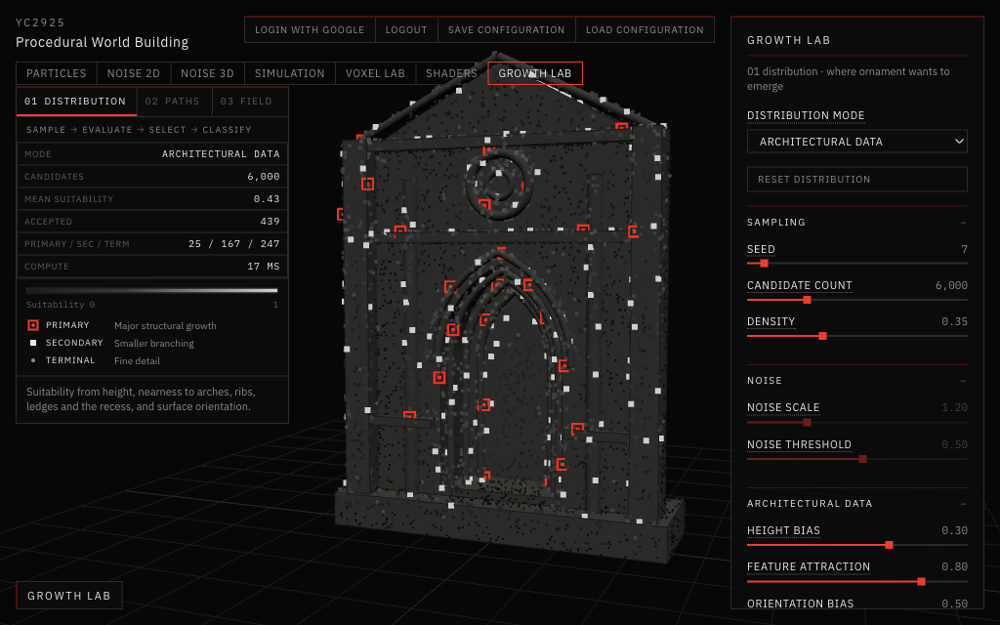
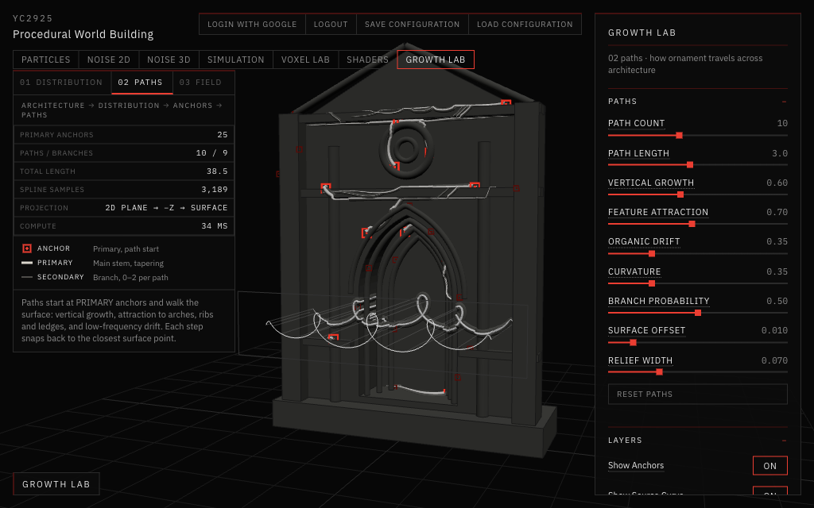
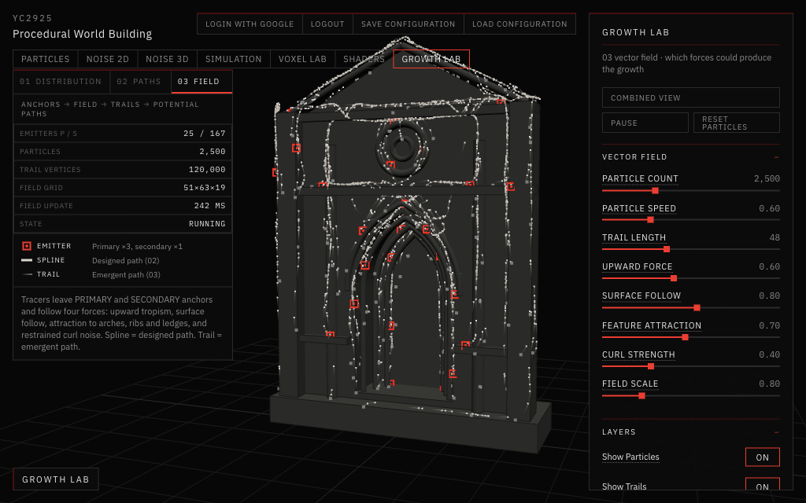
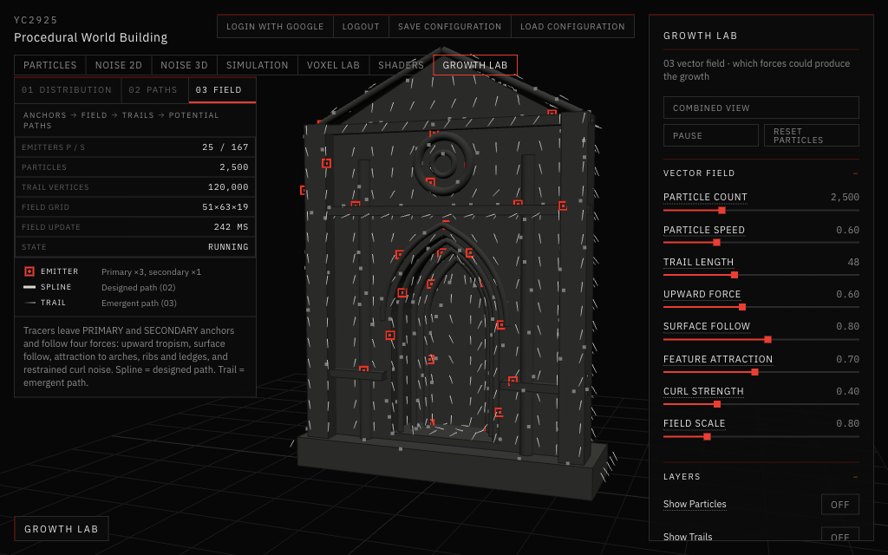
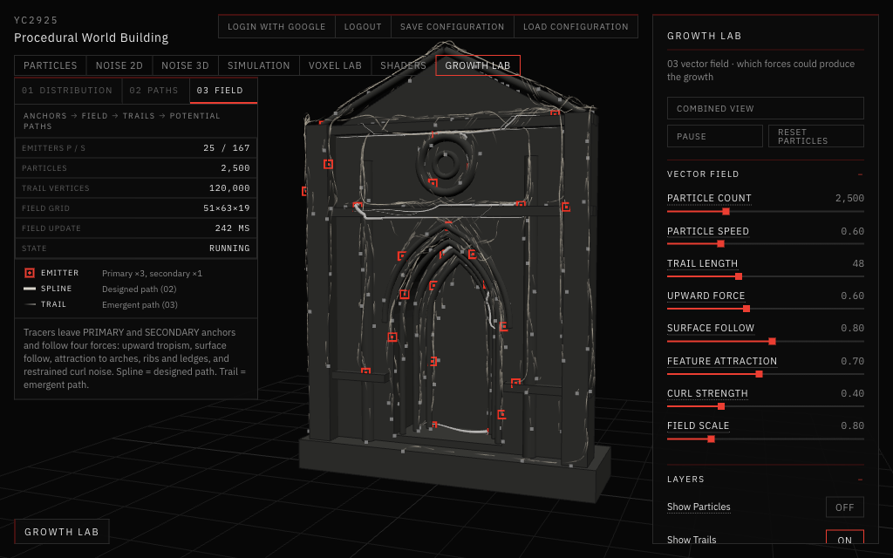

# 09 — Growth Lab

Session date: **4 October 2026**. Tab: **Growth Lab**.

This study is part of my research on **procedural vegetal ornament on sacred architecture**. The question behind it is simple:

> If carved vegetation grew on a Gothic wall by itself, following rules, what would those rules be?

Growth Lab answers that in three steps. Each step is one small experiment, and each one feeds the next:

| Study | Question | Answer it produces |
|---|---|---|
| **01 Distribution** | *Where* can ornament emerge? | A set of growth **anchors** on the wall |
| **02 Paths** | *How* does ornament travel across the architecture? | Smooth **spline paths** that start at the anchors |
| **03 Vector Field** | *What invisible forces* could produce that growth? | **Particle trails** pushed by a field of forces |

All three studies use the **same wall** and the **same anchors**. Changing the seed in 01 changes what happens in 02 and 03.

```
ARCHITECTURE → DISTRIBUTION → GROWTH ANCHORS → PATHS
                                     ↓
                               VECTOR FIELD → PARTICLE TRAILS → POTENTIAL PATHS
```

Nothing here is a finished plant. There are no leaves and no green. The vegetal quality is meant to come only from **where** things start, **how** they bend and branch, and **how closely** they hug the architecture.

---

## The test wall

Instead of a full cathedral, every study uses one simple, abstract Gothic fragment (`app/src/growth/facade.js`):

- a wall with a pointed gable;
- a large **pointed arch** opening with a recessed door at the back;
- three stepped **archivolts** (the arched bands that go deeper into the opening) and a hood moulding above the arch;
- **corner pilasters** and two thin **columns**;
- horizontal **ledges**: a plinth, a split string course, a course above the arch and a cornice;
- a round window (**oculus**).

Every part knows what it is (`wall`, `arch`, `column`, `ledge`, `ring`, `recess`). That matters because the studies ask architectural questions such as "how close is this point to an arch edge?". The organic rock and specimen from [08 Shader Experiments](../08-shaders-experiments/README.md) could not be reused, because their parts carry no such labels.

The wall is plain grey with thin dark edges, on a dark background. Red is only used for the most important marks (primary anchors, the active study), following the [style guide](../style-guide.md).

---

## 01 — Distribution: where can ornament emerge?



*Architectural Data mode with default settings. Grey dots show how suitable each spot is (darker means less suitable). Red squares are primary anchors, white squares secondary, small grey dots terminal.*

### What it does, in plain words

1. **Scatter.** About 6,000 candidate points are spread over the visible surfaces of the wall, never inside it or floating in the air. Bigger surfaces get more points.
2. **Score.** Every point gets a **suitability** score from 0 (bad place to grow) to 1 (ideal place to grow).
3. **Select.** Points with high scores are more likely to be kept. The kept points are the **accepted anchors**.
4. **Classify.** Each accepted anchor gets a role:
   - **Primary** (red): where a major stem would start. These are rare, well spaced, and always on an architectural feature.
   - **Secondary** (white): where smaller branches would start.
   - **Terminal** (grey dot): fine detail.

### Three ways to score

| Mode | Idea | What you see |
|---|---|---|
| **Random** | Every spot is equally good (the baseline) | Anchors spread evenly, ignoring the architecture |
| **Noise** | A smooth noise pattern decides | Organic patches, but they cross arches and ledges blindly |
| **Architectural Data** | The wall itself decides | Anchors gather on arches, columns, the round window and ledge corners. Plain wall stays mostly empty |

In **Architectural Data** mode, the score combines three readable ideas:

- **Height**: higher (or lower) on the wall is preferred.
- **Feature proximity**: near arch edges, columns, ledges, the oculus, and deep inside the recessed portal. Where two features meet, the score is highest.
- **Orientation**: upward-facing surfaces (ledge tops, sills) keep their score, vertical surfaces lose a little, and downward-facing surfaces (the undersides of ledges) lose most.

**What we learned while tuning it.** At first orientation was averaged in like the other two. Since almost every surface is vertical, it added the same value everywhere and made all scores look alike. Switching orientation to a multiplier, and tightening the feature reach, made the plain wall clearly low and the features clearly high.

### Controls

Distribution Mode, Seed, Candidate Count and Density; Noise Scale and Noise Threshold (Noise mode only); Height Bias, Feature Attraction and Orientation Bias (Architectural mode only); Show Candidates, Show Suitability and Show Accepted. Controls that don't apply to the current mode are greyed out. The display toggles only show or hide layers and never recompute anything.

---

## 02 — Paths: how does ornament travel?



*Paths study with Show Source Curve and Show Relief on. Light lines are paths grown from the red anchors. In front of the portal you can see the 2D scroll, its projection rays, and the same scroll laid onto the columns and recess.*

A **spline** is a smooth curve through a list of points. Here a spline stands for the hidden structural line of a future ornament: a stem, a vein, a rib, a tendril or a piece of tracery.

### Growing a path on the wall (mesh → spline)

Each path starts at one of the **primary anchors** from 01 (the most suitable first). It then grows in small steps. At each step three influences are mixed into one direction:

- **Vertical growth**: a pull upward, like a plant reaching for light.
- **Feature attraction**: near an arch, column or ledge, the path turns to run along it.
- **Organic drift**: a gentle, slowly changing wobble so the path is not mechanical.

On top of that, **Curvature** adds a steady curl that gets tighter towards the tip, like a tendril.

**How the path stays on the wall.** After every step the point is snapped back to the nearest spot on the wall's surface, then lifted a tiny distance off it. The step also presses slightly into the surface, which lets paths wrap around ledge edges and over columns instead of flying off. After the walk, the points are smoothed into a curve (a Catmull-Rom spline). The curve is then sampled densely and every sample is snapped to the surface again, so the smooth curve can't cut through corners.

**Branching.** Each primary path can sprout 0–2 **secondary** paths. They are thinner and shorter, and they leave the parent at a shallow angle so the split looks smooth.

**Drawing.** Paths are drawn as tubes that **taper** from a thick start to a fine tip, in a pale bone colour.

### 2D → 3D projection study

This answers the assignment question "How can a 2D line be projected onto a 3D surface?"

1. A looping **2D scroll** (an ornamental curl pattern) is drawn on a flat plane floating in front of the portal.
2. From each point of the scroll, a straight ray is shot backwards onto the wall, like a slide projector.
3. Where a ray lands, that becomes a point of the new 3D curve. The curve therefore dips into the recess, climbs over the columns and wraps onto the arch jambs.

**Show Source Curve** shows the original flat curve, its plane, a few of the projection rays (faint lines), and the resulting curve on the wall, so you can see the transformation in one view.

### Spline → mesh: relief

This shows the opposite relationship: the curve changes the architecture. **Show Relief** sweeps a low, rounded rib along every path in the same stone colour as the wall. The ornament then reads as **carved into** the stone rather than lying on top of it. This is simple added geometry, not an expensive boolean cut.

### Controls

Path Count, Path Length, Vertical Growth, Feature Attraction, Organic Drift, Curvature, Branch Probability, Surface Offset and Relief Width; Show Anchors, Show Source Curve, Show Projected Paths and Show Relief; Reset Paths. The Distribution controls stay available (collapsed) below, because they decide where paths start.

---

## 03 — Vector Field: what forces could produce the growth?



*Default Vector Field view. About 2,500 growth tracers leave the anchors. Their fine trails gather along the arches, columns, oculus and gable.*

Here the growth is not designed directly. Instead, invisible forces act on small **particles**, and the particles draw **trails** as they move. These are not decorative sparkles. Each particle is a **growth tracer**, and its trail is an **emergent path**.

### Where particles come from

Particles are released from the **primary and secondary anchors** of 01. Primary anchors release three times as many, because they represent major growth. Particles start just above the stone.

### The four forces

| Force | Plain meaning |
|---|---|
| **Upward force** | Plants tend to grow up, so particles drift upward |
| **Surface follow** | Particles are pulled onto a thin layer just above the stone, and their motion away from the stone is removed, so they crawl along the wall instead of flying off |
| **Feature attraction** | Near arches, archivolts, columns, ledges and the oculus, particles run along those lines and are drawn onto them. This is the same architectural data as in 01 and 02 |
| **Curl / noise** | A restrained swirl that adds variation and slight branching, kept low so the result stays architectural rather than smoky |

**How it stays fast.** The parts of the field that depend only on the wall (nearest surface, nearest feature) are worked out once on a coarse 3D grid around the facade. That takes about a quarter of a second, the first time study 03 opens. After that, each particle just looks up the grid, which is very cheap.

### Particle lifecycle

A particle is sent back to an anchor when it lives too long, wanders too far from the wall, or leaves the area. The number of particles never grows, so memory stays constant and the activity is continuous.

### Trails

Each particle remembers its last few dozen positions. All trails are drawn together as thin lines that fade out towards the tail, in a soft bone colour. The aim is something like engraved drawing lines or fine fibres, not comets or fireworks.

### Seeing the field



*Show Vector Field with particles and trails hidden. Each short stroke is one sample of the combined force near the wall, dark at the tail and light at the head. Most point upward, and they bend near the features.*

**Show Vector Field** draws a sparse grid of short strokes near the surface. It is the "invisible" field made visible: the thing that is driving the particles.

### Spline vs trail

- **Spline (02)**: an explicit path. I design the rules and the curve is the result.
- **Trail (03)**: an emergent path. I only design the forces, and the path appears by itself.

**Show Splines** lays the 02 paths over the 03 trails so the two can be compared directly. Trails are **not** turned into tubes yet; that is for a later stage.

### Combined View



*Combined View: the wall, the red anchors, six designed splines, and the emergent trails, with debugging layers off.*

**Combined View** is a one-click preset that shows the architecture, the anchors, a small number of splines and the particle trails. It hides the debugging layers (the field strokes and particle dots). It is the closest image so far to the goal: an architectural fragment slowly being colonised by an invisible growth logic, where the vegetation is a consequence of rules acting through the architecture, not applied decoration.

### Controls

Particle Count, Particle Speed, Trail Length, Upward Force, Surface Follow, Feature Attraction, Curl Strength and Field Scale; Combined View, Pause/Play and Reset Particles; Show Particles, Show Trails, Show Vector Field, Show Splines and Show Anchors.

---

## Performance (measured in the browser this session)

| Situation | Result |
|---|---|
| 01 Distribution, 6,000 candidates | about 15–20 ms to recompute after a slider change |
| 02 Paths, 10 paths + branches | about 30 ms to regrow |
| 03 field grid (first open only) | about 220–250 ms |
| 03 curl update (Field Scale change) | about 24 ms |
| 03, 2,500 particles, 48-step trails | 120 fps (the browser's cap), about 0.4 ms of particle maths per frame |
| 03, 5,000 particles, 80-step trails (400,000 trail points) | still 120 fps |

Particles live in plain number arrays and are drawn as a single line object and a single point object. There are no React components per particle, and the update loop creates no new objects.

---

## What was checked

- All three studies run with no console errors.
- The other tabs (Particles, Noise 2D, Noise 3D, Simulation, Voxel Lab, Shaders) still open and render.
- Lint and the production build pass.

**Existing issue found (not fixed).** The Simulation tab logs a shader error: `uWaterColor` is used in the water shader of `app/src/simulation/HydraulicWorld.jsx` without being declared. It predates this session, and the Simulation code was deliberately left untouched. The fix is a single line, `uniform vec3 uWaterColor;`, added to that shader.

---

## Not done yet (on purpose)

- No leaves, no finished plants, no high-resolution ornament.
- Particle trails are not converted into tubes or relief yet.
- The relief in 02 is added geometry, not a real carved cut.

Those are the next steps: using what the trails reveal to generate the final procedural ornament.

---

## Where the code lives

| File | What it does |
|---|---|
| `app/src/views/GrowthLabView.jsx` | The Growth Lab tab: study switch, status panel, wiring of all three studies |
| `app/src/growth/facade.js` | The test wall and its labelled features |
| `app/src/growth/distribution.js` | 01: sampling, suitability, selection, classification |
| `app/src/growth/surface.js` | Snapping points to the wall (closest point) and raycasting (2D → 3D) |
| `app/src/growth/paths.js` | 02: path growth, branching, projection study, tapered tubes and relief |
| `app/src/growth/field.js` | 03: the force grid, curl noise, field strokes |
| `app/src/growth/particles.js` | 03: particles, lifecycle, trail storage |
| `app/src/growth/GrowthScene.jsx`, `PathsScene.jsx`, `FieldScene.jsx` | Drawing each study in 3D |
| `app/src/growth/settings.js` | Default values, presets and notes |
| `app/src/ui/GrowthLabPanel.jsx`, `PathsControls.jsx`, `FieldControls.jsx` | The right-hand control panels |

The tab was added to `app/src/App.jsx` and `app/src/ui/AppTabs.jsx`. Styles were added to `app/src/App.css`, all under `growth-` class names, without changing existing styles.
