# Week 4

This week added two assignment deliverables to the existing procedural world-building app:

1. **Voxel Exercise** — a standalone Voxel Lab workspace for density fields, caves, CSG, meshing, chunking, and performance.
2. **Firebase** — Google login, Firestore save/load, and a public hosted site.

The existing Particles, Noise 2D, Noise 3D, and hydraulic Simulation tabs were left in place. Voxel Lab is a separate workspace that reuses the same interface system.

Related notes: [Voxels](../Tutorials/Voxels.md), [Firebase tutorial](../Tutorials/Firebase_Tutorial.md).

---

## 1. Voxel Exercise

Voxel Lab started as an empty Three.js scene (perspective camera, orbit controls, lighting, and a grid). Each later step reused the same scalar density volume: **density > 0 is solid**, **density ≤ 0 is empty**. Cubes, caves, CSG, and meshes all read that field.

### Density field

The first test filled a small 3D grid (about 24³) with a distance-based sphere and drew solid cells as cubes. Controls were limited to Show / Hide Voxels and Voxel Resolution so the grid itself stayed readable.

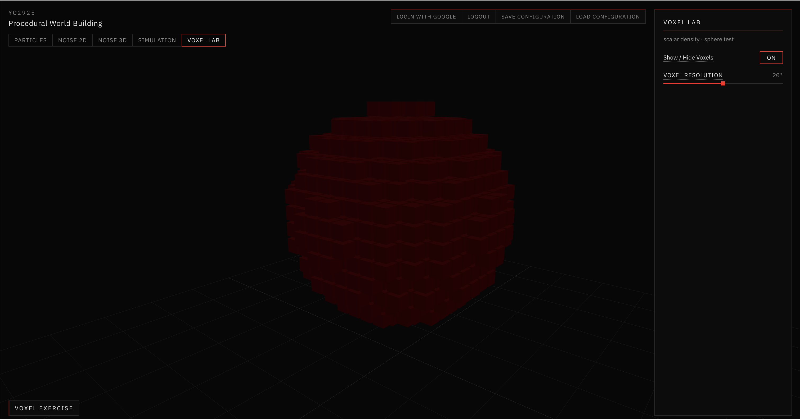

### Procedural voxel terrain

The sphere function was replaced with volumetric rolling terrain. Coherent noise sets a surface height; cells below that surface are solid and cells above it are empty. This is a 3D density volume, not a displaced heightmap plane. Controls: Terrain Scale, Terrain Height, Noise Frequency, and Voxel Resolution.

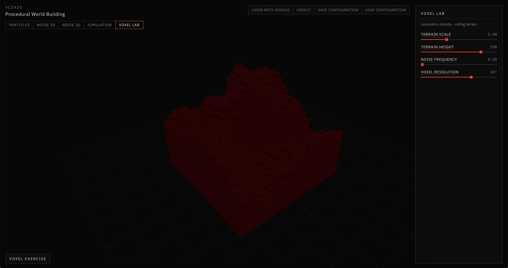

### Density modes and volumetric caves

A Density Mode dropdown switches the same sampler between Terrain, Sphere, Floating Island, and Strata. Floating Island tapers underneath so the volume is obvious; Strata cuts layered geology through the block.

Enable Caves then samples 3D noise through the volume and subtracts density inside the solid, so voids form under the surface instead of only wrinkling the top. Cave Frequency, Threshold, and Strength control how open the interior becomes.

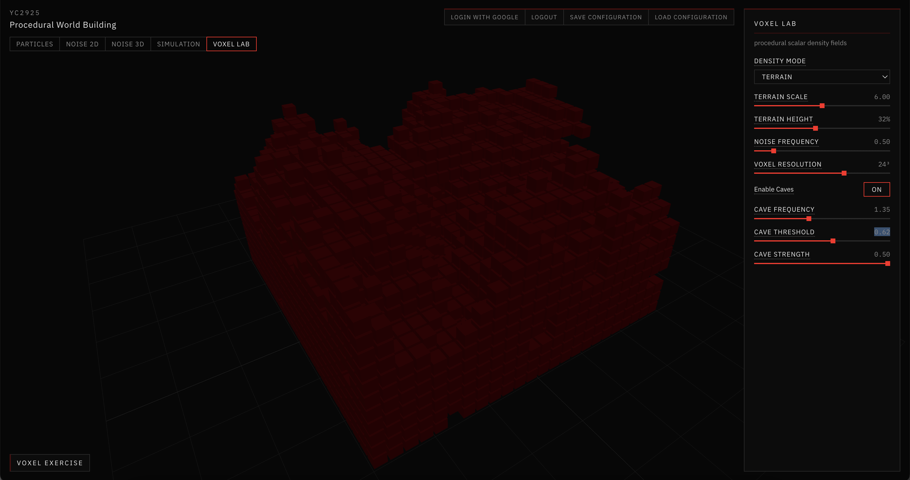

### CSG operations

A movable wireframe sphere is combined with the terrain density using None, Union, Subtract, Intersection, Smooth Union, and Shell. These are min/max-style operations on scalar values, not boolean cuts on cube meshes. X/Y/Z sliders place the sphere; Blend Strength and Shell Thickness apply to Smooth Union and Shell.

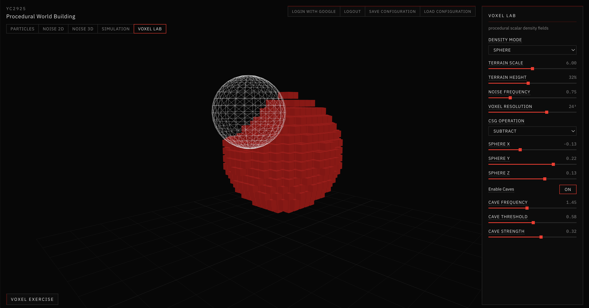

### Marching Cubes

Display Mode switches between Voxels, Marching Cubes, and Both. Marching Cubes turns the same density field (terrain, caves, modes, and CSG) into a continuous surface, so changing the field updates both representations.

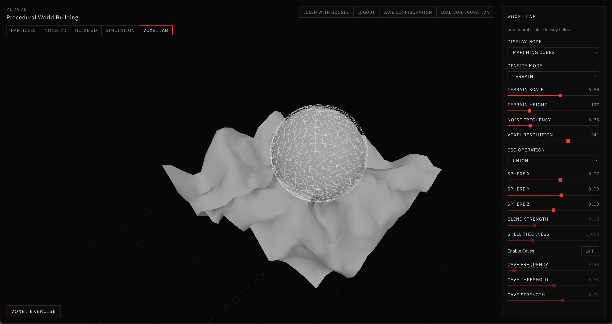

### Resolution comparison and chunking

Resolution presets Low / Medium / High (16 / 32 / 48) regenerate density, cubes, and the surface mesh together. A debug panel reports resolution, sample/voxel count, vertices, triangles, and generation time so quality can be compared with cost.

The volume is then split into independent chunks with ghost-cell borders. Each chunk can remesh on its own. Show Chunk Boundaries draws wireframe boxes and lists chunk count and chunk dimensions.

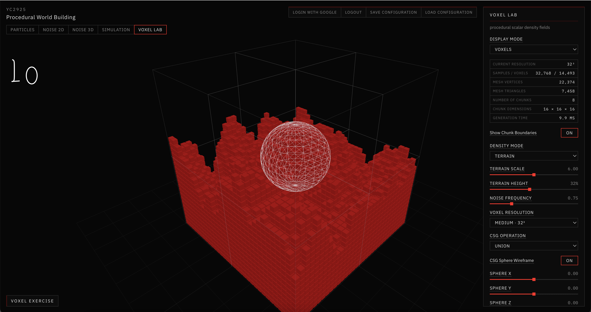

### Localized updates and performance

Moving the CSG sphere remeshes only overlapping chunks. Debug lines show Chunks Updated and Update Time; highlighted boundaries mark the chunks that rebuilt. At High / 48³ this keeps generation in a few milliseconds instead of rebuilding the full 64-chunk volume.

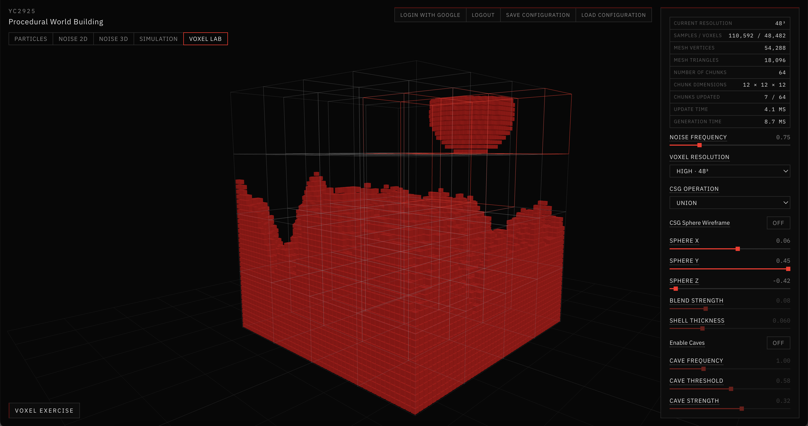

A Performance section exposes resolution, chunk size, visibility toggles, and live counts (samples, active/total chunks, triangles, last generation time). Render-distance streaming was not added because this world is a finite resident volume.

Alternative meshing methods — Marching Cubes, Greedy Meshing, Surface Nets, and Dual Contouring — sit in one dropdown on the same density field.

### Assignment View

Assignment View does not add new simulation features. It groups the existing tools into nine demo topics and adds a compact live status strip for screenshots:

1. Density Field
2. Procedural Voxel Terrain
3. Volumetric Caves
4. CSG Operations
5. Marching Cubes
6. Resolution Comparison
7. Chunking
8. Performance / Optimization
9. Alternative Meshing Methods

The strip shows Density Mode, Resolution, Display Mode, CSG Operation, Chunk Count, Triangle Count, and Generation Time.

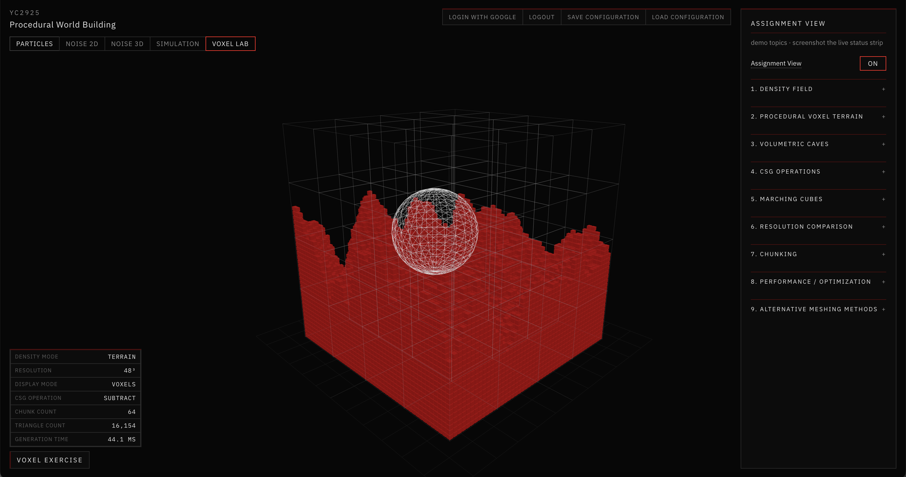

---

## 2. Firebase installation

Firebase was installed on the React + Vite app so a logged-in user can save and reload configuration, and so the assignment can be opened from a public URL. The connection lives in `app/src/firebase.js`. Login, logout, save, and load stay in `app/src/App.jsx`. Step-by-step setup is in [Firebase tutorial](../Tutorials/Firebase_Tutorial.md).

### Firestore database

Authentication and Cloud Firestore were enabled in the Firebase console. Saved settings are stored per user at `users / {uid} / configs / latest`, with the payload in `configJson`. The console screenshot below shows a written document after a successful save.

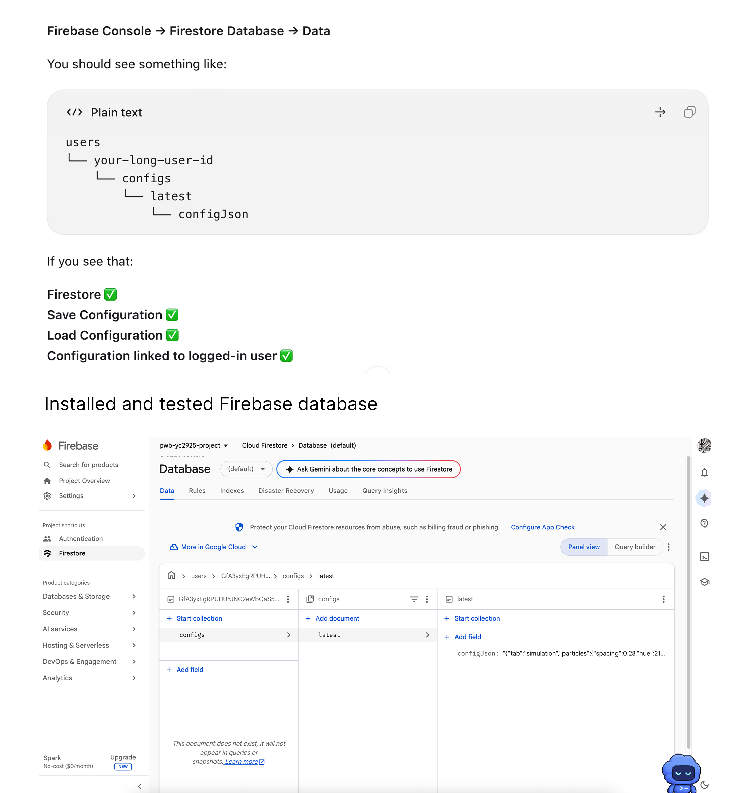

### Auth, save, and load in the app

Login with Google, Logout, Save Configuration, and Load Configuration were added to the existing chrome and restyled to the project style guide. Save writes the current tab settings for the signed-in user. Load restores that document. The same buttons work on Particles and on Simulation.

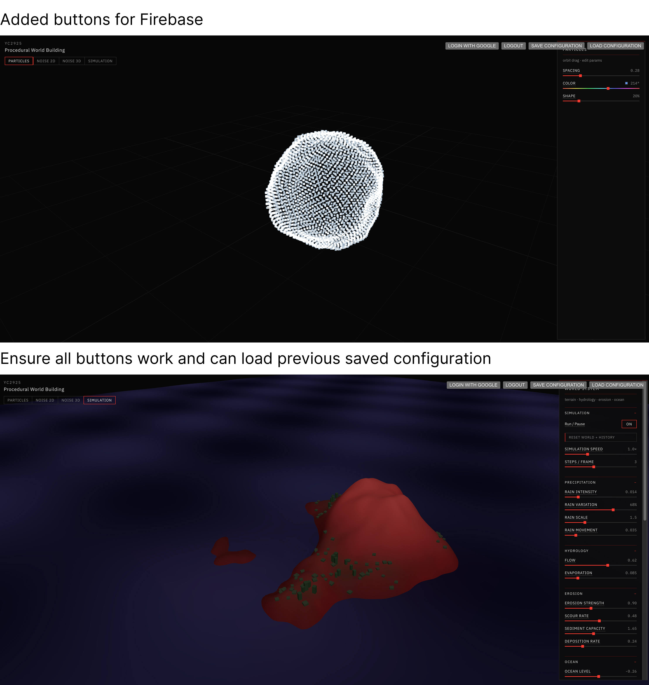

### Public hosting

Firebase Hosting serves the Vite `dist` build. After `firebase init hosting`, updates are:

```bash
npm run build
firebase deploy --only hosting
```

The public assignment URL is:

https://pwb-yc2925-project-64c07.web.app

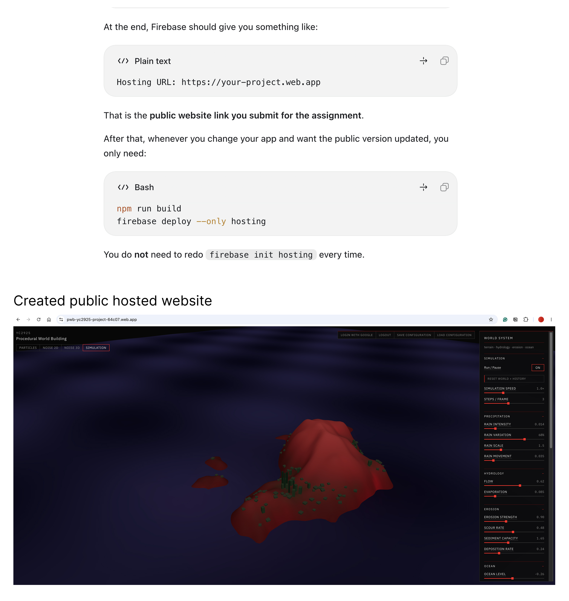
