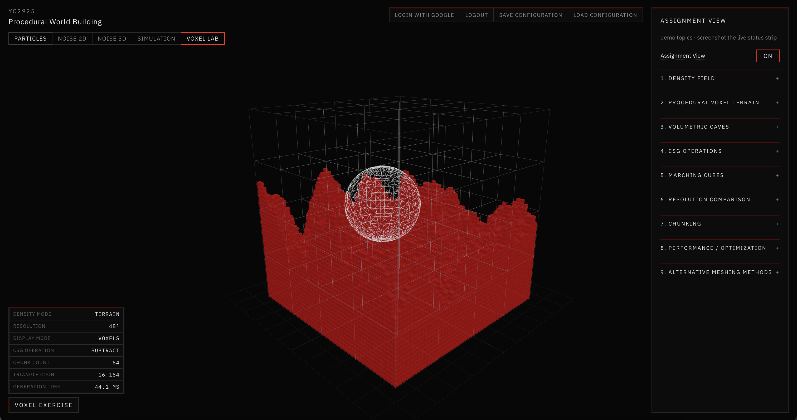

# Procedural World Building

This repository is a study notebook for a Procedural World Building course. It documents experiments in procedural generation, terrain, environmental simulation, voxels, and related computational systems.

The working application is a React + Three.js instrument: six tabs over a dark viewport. Notes below describe what was tried, which parameters matter, and what changing them actually does. They are not a product spec.

Live build: [pwb-yc2925-project-64c07.web.app](https://pwb-yc2925-project-64c07.web.app)

*Voxel Lab in Assignment View: numbered topics, live status strip, and a CSG subtract on volumetric terrain.*

*Public Firebase Hosting build of the Simulation tab: noise-based island, ocean boundary, inland water, and vegetation responding to that hydrology.*

---

## Table of Contents

- [01 — Particles](Docs/01-particles/README.md)

  First Three.js experiment: a spherical point cloud whose spacing, hue, and outer shape can be warped with 3D value noise.

- [02 — Procedural Noise](Docs/02-procedural-noise/README.md)

  2D simplex / fractal heightmaps. Three blendable layers, noise types (ridged, billow, warp, …), and shaping curves that become the shared terrain source.

- [03 — Terrain Generation](Docs/03-terrain-generation/README.md)

  The same heightmap lifted into 3D, with island falloff, smoothing, and a red height gradient. This mesh is also the starting landscape for Simulation.

- [04 — Hydraulic Simulation](Docs/04-hydraulic-simulation/README.md)

  Grid-based rainfall, downhill flow, sediment transport, erosion, deposition, and evaporation, plus a spatial rainmap and ocean boundary.

- [05 — Vegetation Simulation](Docs/05-vegetation-simulation/README.md)

  Growth driven by soil moisture, slope, elevation, flooding, and recent erosion — not a separate decorative scatter.

- [06 — Voxel Experiments](Docs/06-voxel-experiments/README.md)

  Scalar density fields, caves, CSG, Marching Cubes and other meshers, chunking, and a demo-oriented Assignment View.

- [07 — Firebase](Docs/07-firebase/README.md)

  Google login, Firestore save/load of configuration, and Hosting for a public assignment URL.

- [08 — Shader Experiments](Docs/08-shaders-experiments/README.md)

  Shader Lab: seven strategies on plane / sphere / relief / vegetal meshes. Growth, relief, stone, and related studies for vegetal ornament on religious facades.

- [Shader Studies](Docs/Tutorials/Shader-Studies.md)

  Research brief that preceded Shader Lab. Implemented experiments and screenshots live in 08.

- [Style guide](Docs/style-guide.md)

  Visual rules for the UI: near-black chrome, one red signal color, square controls.

A fuller index, weekly notes, and tutorials live in [Docs/README.md](Docs/README.md).
